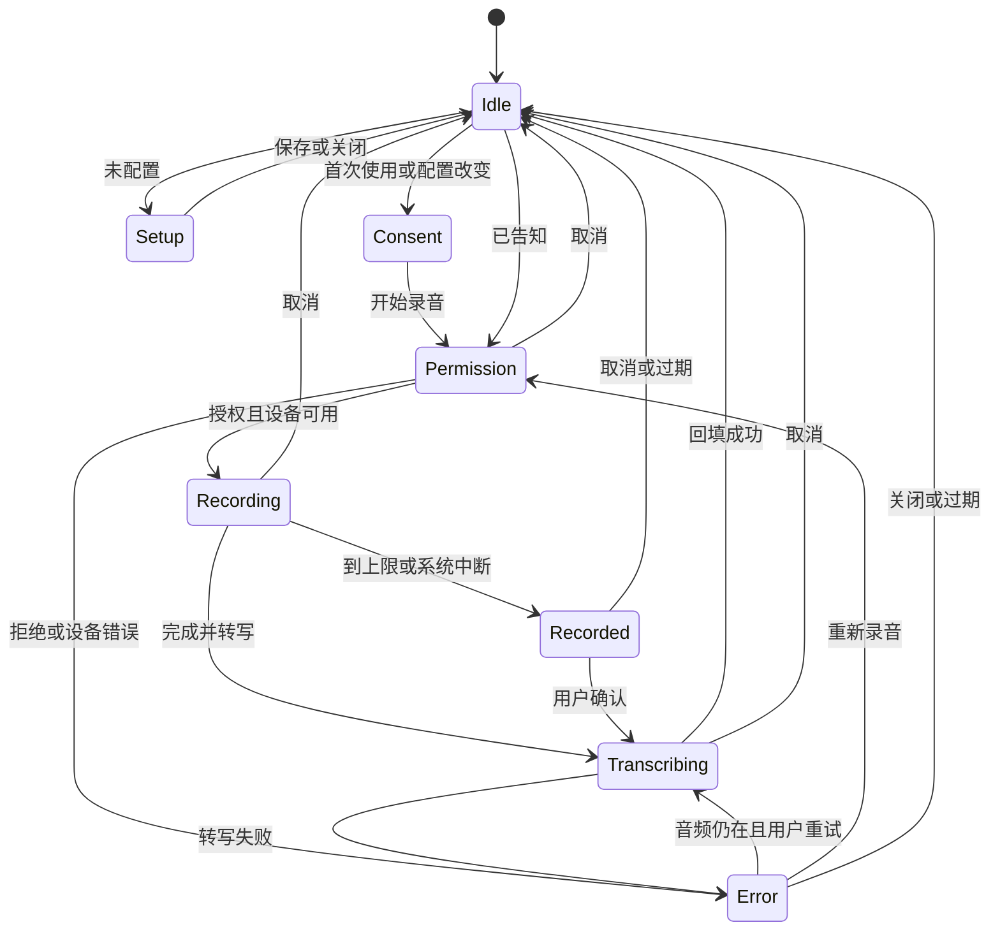

# EvoWork 语音输入设计

| 项目 | 内容 |
| --- | --- |
| 状态 | **Draft v0.1 · 待确认，尚未实现** |
| 日期 | 2026-10-06 |
| 目标 | 参考 ChatGPT / Codex 当前桌面体验，让用户用语音写需求，再编辑、发送 |
| 入口 | 桌面首页与任务页共用的 Composer；设置中的语音输入配置 |
| 关联 | [03 首页与输入区](03-home-and-composer.md#47-语音麦克风)、[01 设计系统](01-ui-design-system.md)、[09 服务层](09-service-layer.md)、[11 账号与模型](11-account-and-models.md)、[总纲 K1–K7](../evowork-on-codex-design.md) |
| 阅读建议 | 优先确认 §2 的范围和 §12 的问题；其余章节描述推荐方案的交互与实现边界 |

本文中的“推荐”均为待评审方案；不覆盖既有产品决策，也不表示已拿到服务商、密钥、预算或真机验收结果。确认后再同步关联设计、总纲出网登记及实现计划。

## 1. 参考体验与现状

### 1.1 ChatGPT / Codex 的当前参考基线

官方说明区分两种能力：**语音听写**把讲话变成提示词文字；**语音对话**用于实时交谈。当前听写说明明确支持在 Composer 可见时用 `Ctrl+Shift+D` 开始，转写进入输入框后可审阅、编辑，再发送。[来源：Prompting](https://learn.chatgpt.com/docs/prompting#use-voice-dictation)、[来源：Voice](https://learn.chatgpt.com/docs/features/voice#chatgpt-voice-and-voice-dictation)。

当前快捷键文档在 macOS 上标为 `⌃⇧D`，Windows/Linux 为 `Ctrl+Shift+D`；macOS 的 `⌃` 是 Control，不是 Command。[来源：Commands](https://learn.chatgpt.com/docs/reference/commands)。

本方案继承三个核心行为：入口在输入区、录音状态明确、转写作为可编辑草稿。录音确认按钮、波形样式、取消策略、时长上限与权限告知属于 **EvoWork 的设计建议**，不声称是对参考产品逐像素复刻。本文未进行参考产品的实时 UI 操作或像素测量。

### 1.2 EvoWork 已有能力与缺口

| 位置 | 已核对的现状 | 设计影响 |
| --- | --- | --- |
| `apps/desktop/src/renderer/components/composer.tsx` | 有 `micAvailable` / `onMic` 与麦克风按钮；没有录音、转写状态机 | 可以扩展共用 Composer，避免首页与任务页各做一套 |
| `apps/desktop/src/renderer/app.tsx` | 负责草稿、发送、任务/项目切换；未接语音动作 | 回填必须接现有草稿更新逻辑，并防止跨任务串入 |
| `apps/desktop/src/preload/index.ts`、`main/renderer-bridge.ts` | 已有语义化 IPC 动作与宿主接线机制 | 新动作沿用此通道，渲染层不拿转写密钥、不直接请求服务 |
| `apps/desktop/src/main/secret-store.ts` | 有系统密钥库封装及不可用状态 | 复用安全存储机制，禁止增加默认明文保存路径 |
| `services/gateway/src/server.ts` | 当前处理 Responses、模型目录与健康检查；未提供独立转写端点 | 聊天模型可用不等于转写可用，不能直接承诺复用现有接入 |
| `packages/protocol/src/methods.ts` | 登记了 `thread/realtime/start` / `appendAudio` / `stop` | 方法名存在不等于桌面听写链路已接通 |
| 上游 `app-server-protocol/.../v2/realtime.rs` | 实时会话以 Thread 为上下文，另有实时时间线与音频帧协议 | 需要验证会话副作用、鉴权、转写模式及国内服务兼容性；不能仅凭方法存在选为听写实现 |
| `build/electron-builder.yml`、`build/entitlements.mac.plist` | 当前未声明本功能需要的麦克风说明与录音 entitlement | 开发窗口能录音不代表安装包可录音，打包验收必须独立覆盖 |

现有 03 §4.7 提议复用 `thread/realtime/*`，且按聊天 provider 是否支持音频隐藏麦克风。本文建议评审后改为**独立的语音转写能力**：听写成功后仍走文字输入，因此 DeepSeek、Kimi 等当前选中的聊天模型无需具备音频能力。此处是对原方案的修订提议，尚未回写为已批准规则。

## 2. 产品范围

### 2.1 推荐首版范围

1. 用户点击麦克风或按快捷键，开始录入一段需求。
2. 输入区显示真实音量变化、已录时长以及取消/完成操作。
3. 用户选择“完成并转写”，停止录音，将录音交给已配置的转写服务。
4. 识别文字插入原光标/选区位置，用户可编辑、撤销，再手动发送。
5. 权限、设备、网络、额度等失败都有明确原因与恢复入口。
6. 中文为首要验收语言，同时覆盖中英混合、数字和常见技术词。

**首版完成判据是“语音 → 可编辑草稿”的完整闭环。** 不因为转写成功而创建任务、启动回合、执行本地指令、排队或插话。

### 2.2 建议后续范围

- 持续语音对话、播报回复、自然打断、通过讲话协调其它任务。
- 系统全局听写、其它应用输入框回填、后台监听、按住快捷键讲话。
- 多人会议、说话人识别、录音文件导入、历史录音管理。
- 首版之后再评估流式转写、用户词表、专有名词纠正、语音润色。

这些需求不与本次 Composer 听写共用“默认已授权”的语义，后续需单独设计。

## 3. 用户流程

### 3.1 首次使用

```text
点击麦克风 / Ctrl+Shift+D
  ├─ 企业禁止语音 → 显示原因，不申请麦克风
  ├─ 未配置服务 → 显示“先配置语音转写”与设置入口，保留草稿
  └─ 服务已配置 → 显示目的地与传输说明
                     ↓ 用户选择开始录音
                 系统麦克风授权
                     ├─ 拒绝 → 权限提示与系统设置入口
                     └─ 允许 → 录音 → 完成并转写 → 回填草稿
```

首次告知建议：

> 录音先保留在本机内存。点击“完成并转写”后，本段录音会发送到 **〈转写服务名称 / 主机〉**。EvoWork 不保存录音；服务方的留存规则由其决定。识别文字会填入输入框，由你编辑后发送。

按钮：“取消”“开始录音”。告知确认记录仅绑定该服务配置版本；更换目的地、密钥绑定的服务或处理方式后重新告知。系统麦克风授权与录音上传授权是两件事，前者不能代替后者。

### 3.2 常规使用

已配置、完成首次告知且系统授权有效时，点击麦克风直接开始录音。录音区一直显示目的地主机；“完成并转写”是**本次上传的显式动作**，不额外再弹一个重复确认框。

```text
已有草稿：[帮我整理 | 下周的计划]

录音中： [取消 ×]  ▂▄▆▃▅▂  00:12  [完成并转写 ✓]
          将发送到：〈服务主机〉

转写中： [取消]   正在转写…

完成后：[帮我整理 明天的销售会议纪要，下周的计划]
          输入框恢复焦点，可编辑、撤销、手动发送
```

示意中的标点以识别结果和原文为准，不做语义改写。中文相邻文字默认不额外插空格；英文/数字的边界空格按简单、可测试的规则处理。

### 3.3 取消与重试

- 录音中取消：停止所有音轨、丢弃内存音频，草稿不变，零转写请求。
- 转写中取消：中止客户端网络请求、丢弃结果和本地音频，恢复草稿。
- 已上传后取消只能阻止客户端继续处理，**无法承诺撤回服务端已收到的内容或取消计费**。
- 转写失败：保留音频供用户手动重试；每次重试仍显示相同目的地，不自动重试或换服务。
- “重新录音”：先释放旧音频，再申请新录音，不同时保存多段。
- 建议待处理音频最多保留 5 分钟；过期清理后提示“录音已清除，请重新录音”，不改变文字草稿。

## 4. 输入区与键盘行为

### 4.1 入口与可用性

| 条件 | 麦克风表现 |
| --- | --- |
| 未配置转写服务 | 保留可发现入口；点击说明并提供设置动作，不能开始录音 |
| 服务已配置 | 可点击，tooltip“语音输入 · Ctrl+Shift+D” |
| 聊天模型不支持音频 / 尚未配置聊天模型 | 不影响听写；发送仍遵守原有模型检查 |
| 操作系统没有录音能力或被企业策略禁止 | 禁用并说明原因；不得显示点了无响应的按钮 |
| 已有其它窗口录音/转写 | 提示“另一个窗口正在使用语音输入” |
| 当前任务正在执行 | 仍可听写追问；回填后按现有排队/插话选择手动发送 |
| 当前视图没有 Composer，或在审批/设置模态中 | 快捷键不开始录音，不劫持当前界面操作 |

麦克风放在发送按钮附近，保留与现有布局一致的命中区。开始录音后用录音控制区替代输入区的常规编辑区域，不遮挡任务中的审批或中断操作。

### 4.2 录音与转写状态

- 录音时显示“正在录音”、计时、真实音量柱；颜色使用 `--danger` / `--danger-text`，同时有文字，不只靠红色区分。
- 波形由麦克风采样计算，只用于反馈；不得用固定跳动动画伪装检测到声音，也不得把低音量直接判为“没有有效内容”。
- 转写时显示不确定进度“正在转写…”及取消，不显示没有依据的百分比。
- 建议首版录音与转写期间需求 textarea 只读，发送/入队/插话禁止；已有任务的独立“中断”仍可用。
- 成功回填后恢复光标与焦点；朗读器通过 `aria-live="polite"` 报告状态转换，计时不逐秒播报。
- 尊重 reduced-motion；所有按钮有明确名称、键盘焦点和足够命中区，沿用现有 token。

### 4.3 快捷键

| 输入 | 行为 |
| --- | --- |
| `Ctrl+Shift+D` | Composer 可见时开始；录音中再次按下 = 完成并转写 |
| `Esc` | 有活动听写时优先取消听写；没有活动听写时保留现有任务中断/关闭菜单行为 |
| `Enter` / `Space` | 按焦点按钮的标准行为操作；不把录音态的 Enter 当成发送消息 |
| 输入法组合键 / key repeat | 不触发重复开始、重复转写或发送 |

推荐首版只支持应用内快捷键，不注册全局热键。录音到转写、转写到就绪的同一次按键不能继续传播成发送动作。

## 5. 状态机与资源生命周期



`Recorded` 表示录音已停止、音频仅留在内存中；达到上限不自动上传。设置、告知和错误阶段未持有可重试音频时，“重试转写”不出现。

### 5.1 建议上限

| 项目 | 首版建议 | 行为 |
| --- | --- | --- |
| 单段录音 | 最长 5 分钟 | 停止，提示“已达到录音上限”，用户确认后才转写 |
| 压缩音频 | 最大 20 MiB，且不超过服务能力上限 | 两端校验；达到上限停止，不发送超限请求 |
| 转写请求 | 60 秒超时 | 主进程取消，提示并允许用户手动重试 |
| 同时活动听写 | 每个桌面实例 1 个 | 主进程协调窗口间互斥 |
| 可重试音频留存 | 内存中最多 5 分钟 | 成功、取消、过期、退出后立即解除引用 |

这些是产品建议值，不是参考产品或所有服务商的统一限制，接入前必须按真实服务复核。

### 5.2 必须处理的竞态

1. **取消后系统授权才完成**：`getUserMedia()` 可能迟迟不返回；请求不能简单视为已物理取消。返回时检查会话是否失效，失效即停止新返回的全部音轨，不开始 Recorder。[依据：getUserMedia](https://developer.mozilla.org/en-US/docs/Web/API/MediaDevices/getUserMedia)。
2. **停止后的最后音频块**：确认停止时等最终 `dataavailable` 与 `stop` 事件完成拼接；取消时即使最后音频块到达也直接丢弃。[依据：MediaRecorder.stop](https://developer.mozilla.org/en-US/docs/Web/API/MediaRecorder/stop)。
3. **切任务、项目或草稿**：会话绑定 `draftId + scopeId + draftRevision`；范围变化立即停止、取消请求，迟到结果不得进入新草稿。
4. **同一草稿被其它动作修改**：回填前核对修订号；不一致时显示待插入文本，允许用户明确插入/复制/丢弃，不能拿开始录音时的快照覆盖新内容。
5. **切换设置目的地**：正在等待或重试的旧会话失效；不把旧录音、旧密钥发送给新地址。
6. **窗口销毁、最小化/隐藏、系统锁定或睡眠**：销毁/切页面取消并清理；隐藏/锁定/睡眠停止录音，返回后由用户决定转写或丢弃。不会自动恢复后台录音。
7. **网络取消与重试交错**：每次请求有独立 id；旧请求完成/清理不能覆盖新会话的状态，取消失败也必须阻止旧结果回填。

资源清理包括：MediaStreamTrack、MediaRecorder 回调、AudioContext/节点、音量采样、计时器、Blob/音频块引用和主进程 AbortController。这里的“不留存”指应用主动不写盘并释放引用，不承诺操作系统交换内存或远端服务内存被安全擦除。

## 6. 草稿回填与已有功能衔接

### 6.1 插入规则

- 开始录音前保存 textarea 的选区。默认在光标位置插入；有选区时替换选区，不覆盖其余正文。
- 录音、转写失败和取消都保留原文及选区。
- 成功结果调用现有 `changeDraft`，使正常草稿保存链路继续生效；**录音本身不进入草稿保存**。
- 转写结果中的 `/goal`、`/清空`、`$skill`、`@文件名` 默认只是文字，不自动执行本地命令、不自动创建结构化引用。
- 已有附件、提及与技能引用保持有效；若选区涉及已有引用的文本范围，必须按现有引用一致性规则更新，无法可靠维护时让用户选择在末尾插入。
- 建议一次回填形成一次撤销操作，`Cmd/Ctrl+Z` 撤回此次插入并保留录音前内容；需在真实 Electron textarea 验证，不能仅凭 React state 更新承诺原生撤销栈正常。
- 不额外用聊天模型润色、扩写或改写需求；尤其不能改变否定词、金额、日期、文件路径或命令。

### 6.2 对发送与任务执行的影响

转写完成前不调用 `send`、`turn/start`、`turn/steer`、队列添加或本地命令处理器。完成后仍按原有项目、模型、附件、审批模式和队列规则发送。

首页允许没有项目时先听写；发送阶段再要求选择项目。正在运行的任务不因开始听写而被中断，用户仍可在回填后明确选择排队或插话。

## 7. 转写技术方案

### 7.1 方案比较

| 方案 | 收益 | 代价或前提 | 首版建议 |
| --- | --- | --- | --- |
| 独立 ASR 服务，录音完成后请求 | 与聊天模型解耦；取消前无音频出网；容易覆盖私有部署 | 需确定服务、密钥、费用、国内可达性与数据政策 | **推荐作为通用接口，实际服务待 VOICE-Q2/Q3 确认** |
| 本地 ASR 引擎 | 可离线，录音不出本机 | 模型下载、许可、体积、CPU/GPU、中文准确率与安装体验需验证 | 如果离线是硬要求，应作为首版主方案；否则后续加，不偷偷云端兜底 |
| 系统原生听写 | 可能降低本地引擎维护成本 | 平台和语言能力不同；是否联网不能靠“系统能力”推定 | 可先做 PoC，不能承诺全平台离线 |
| 上游 `thread/realtime/*` | 可复用实时协议，为未来语音对话铺路 | Thread 上下文、鉴权、会话留存/副作用、服务兼容性尚未形成 EvoWork 听写闭环 | 留作验证备选，不作为已证实可直接复用的方案 |
| 浏览器 `SpeechRecognition` | 接口简短 | Electron 运行环境、服务依赖和传输目的地难以按本产品边界控制 | 不作为唯一实现或自动兜底 |

推荐首版采用“本机录音 → 用户确认 → 独立 ASR → 草稿”，提供服务适配接口。**独立 ASR 不等于必须使用某一家国外服务**；国内/企业服务需按其真实协议增加适配与探针，不能因为聊天 API 兼容就声明转写兼容。

### 7.2 录音与请求协议

- 渲染层：`getUserMedia({ audio: ..., video: false })` 捕获，`MediaRecorder` 录音，Web Audio 仅做音量反馈；不把麦克风连接到扬声器，避免回声。
- 录音 MIME 按运行时支持与服务支持的交集选择，例如 WebM/Opus；不把改文件后缀当成格式转换。需要 WAV/PCM 的服务另做内存转换与采样率验证。
- 默认录系统当前麦克风；建议首版不做专门设备管理页，设备切换中断时明确提示重新录音。
- 第一类适配器可支持兼容 `audio/transcriptions` 的 multipart 请求：音频 `file`、转写 `model`、可选 `language`，返回 JSON 中的 `text`。这是公开 API 的一种具体协议，不是所有 ASR 的通用协议。[参考：Create transcription](https://developers.openai.com/api/reference/resources/audio/subresources/transcriptions/methods/create)。
- 响应校验类型、长度和空结果；成功的 HTTP 状态仍需证明返回的是合理识别文本。
- 不使用生成式对话请求替代明确的转写协议，不把聊天上下文、附件、项目文件或任务历史附到转写请求。

### 7.3 实时文字

推荐首版录音时仅显示真实音量，停止后返回完整文字。流式方案可减少等待，但会让音频在录音阶段持续出网，并引入临时文字修订、断流续接与取消后的部分上传语义。

如果“边说边显示文字”是首发要求，需要按 VOICE-Q4 改成独立流式转写设计：首次告知说明持续上传，临时结果显示在临时区域，结束后一次提交草稿；不会把不稳定增量直接覆盖用户正文。

## 8. 架构、配置与 IPC

### 8.1 模块职责（建议）

```text
Composer / 录音控制器（本机采集，内存音频）
                 │ 语义化 IPC，显式本次授权
                 ▼
preload → renderer-bridge → 主进程语音宿主
                            ├─ 配置/系统密钥库/企业策略
                            ├─ 会话互斥、超时、取消、限额
                            └─ ASR 适配器 → 已授权目的地
                 │ 文本结果
                 ▼
现有 changeDraft → 用户编辑 → 手动发送 → 现有执行链路
```

建议先放在 `apps/desktop`：它是输入辅助而非模型工具，不改变执行内核；服务复用需求出现后再抽取 `services/voice`。ASR 不进入 `services/ingest`，保持解析管道不出网的结构性约束。

| 建议改动 | 职责 |
| --- | --- |
| `renderer/components/composer.tsx` | 麦克风、状态区、发送互斥、焦点/选区 |
| `renderer/voice-input.ts`（新增） | 录音状态机、音量、内存生命周期、失效结果处理 |
| `renderer/views/settings.tsx` | 语音输入配置与权限状态 |
| `shared/voice-input.ts`（新增） | 窄 IPC 类型、会话/配置版本、上限与错误码 |
| `preload/index.ts`、`main/renderer-bridge.ts` | 新语义化动作及接线守卫 |
| `main/voice-input.ts`（新增） | 配置、受控网络请求、主进程取消和结果过滤 |
| `main/service-host.ts`、`bootstrap.ts`、`electron-entry.mjs` | 生命周期、窗口来源、系统权限与真实端口注入 |
| `build/electron-builder.yml`、`entitlements.mac.plist` | macOS 安装包录音声明 |

### 8.2 建议动作

| 动作 | 输入 / 返回 | 关键约束 |
| --- | --- | --- |
| `getVoiceSettings` | 返回服务、模型、语言、配置版本、可用性、密钥是否存在 | 无密钥原文；读取不出网 |
| `saveVoiceSettings` | 服务地址、模型、语言、可选新密钥、保存方式 | 地址变更不能继承旧服务密钥；不自动发测试请求 |
| `beginVoiceInput` | 受信窗口、草稿范围 → 短期 session id 与配置版本 | 每实例互斥；校验策略；不上传、不创建 Thread |
| `transcribeVoice` | session id、配置版本、音频字节、MIME、本次确认 → 文本 | 目的地由宿主配置决定；拒绝过期、重复、超限或无授权会话 |
| `cancelVoiceInput` | session id | 取消主进程请求并注销会话；晚到结果失效 |
| `openMicrophoneSettings` | 无任意 URL 参数 | 主进程只打开固定权限设置入口 |

首次告知可另设窄动作持久化接受的配置版本。上述名称与类型是草案，实现时与现有 IPC 清单统一注册；不得暴露通用 `fetch`、任意系统 URL、任意文件路径或 `ipcRenderer`。

主进程不能把渲染层传入一个 `consent: true` 就视为完整可信授权：还需绑定受信顶层窗口、当前会话、服务配置版本和一次性确认状态。确认只授权本次音频，不能被模型工具或后台自动化复用。

### 8.3 设置项

推荐新增“设置 → 语音输入”，由麦克风未配置态直达。

| 项目 | 设计 |
| --- | --- |
| 转写方案 | 实际发布的适配器/服务；不能列出没有实现的提供方 |
| 服务地址 | 自定义/私有服务输入完整转写地址；远端 HTTPS，本机 loopback 可 HTTP |
| 模型 | 独立 ASR 模型，不能从聊天模型列表猜测 |
| 语言 | 自动 / 中文 / 英文；固定语言映射到服务支持的代码 |
| API 密钥 | 只写不读回；留空保留，显式清除；可支持无需密钥的本机服务 |
| 密钥保存 | 系统密钥库可用时加密保存；不可用则仅本次启动，不自动明文保存 |
| 状态 | 未配置 / 已配置但未验证 / 实测成功 / 最近失败，不能把保存成功写成可用 |
| 验证 | 用户主动“录一段测试”；复用同样告知与本次转写确认，不后台发送合成或真实录音 |
| 权限 | 系统麦克风状态、重新检查、系统设置入口 |

服务元数据可保存在本机配置文件或既有设置存储；文件路径与格式在实现前确定。只存元数据和授权配置版本，不保存录音、转写历史或会话正文。密钥不进入该配置文件。

## 9. 隐私、企业策略与打包

### 9.1 K6 出网登记草案

本段是待确认登记，批准云端/私有转写方案后回写总纲，不能先实现再补授权。

| 维度 | 建议边界 |
| --- | --- |
| 为什么出网 | 用户主动把一段讲话转为可编辑需求文字 |
| 何时 | 用户点击本次“完成并转写”或明确的重试动作 |
| 去哪 | 已配置、已告知、企业允许的唯一转写目的地；不静默降级 |
| 带什么 | 本段录音、MIME、模型、可选语言、必要鉴权；不带 taskId、项目路径、附件、聊天正文、设备标识或额外分析埋点 |
| 谁发 | 主进程 ASR 适配器；渲染层、ingest、catalog 无新增网络能力 |
| 去向变更 | 禁止自动跟随重定向；服务目的地变化重验策略并重新告知 |
| 客户端留存 | 原始音频与尚未提交的转写结果只在内存；结果进入普通草稿后按正常草稿规则保存，发送后按正常任务历史规则保存 |
| 远端留存 | 依据所选服务政策，不作“第三方不保存/不训练”的无依据承诺 |
| 离线 | 明确说明远端转写需要网络；未实现本地 ASR 时不给假离线能力 |

地址中不允许嵌入账号密码或密钥查询参数。企业私有地址只在显式配置且策略允许时使用，不能由模型输出任意替换；TLS 失败不可忽略。

不落盘承诺覆盖应用录音缓存、临时文件、失败导出、结构化日志、APM 和自动崩溃附件；若以后要求保存录音，需要新的留存与删除设计。应用不记录转写正文；允许日志字段应限定为结果码、时长、字节数和请求耗时，并按现有日志字段注册制度落地。

### 9.2 企业与账号

- 建议企业策略支持总开关、允许的服务范围、禁止云端音频和允许自定义配置；复用现有可信策略分发，不新增另一条管理通道。
- 企业 deny 优先于用户开关；策略撤销立即停止录音/中止请求，不把已发送内容描述为可撤回。
- 语音权限不由“完全访问”代答，不受聊天审批档位提升而自动打开。
- BYOK 转写可与登录并列；不为使用听写强制创建 EvoWork 账号。
- 若提供 EvoWork 托管 ASR，涉及新的音频内容处理、配额/费用及 D9 边界，需单独确认，不能默认沿用现有聊天额度。

### 9.3 macOS 与跨平台

macOS 需要在实际 `.app` 中声明 `NSMicrophoneUsageDescription`，按 Electron 录音要求补齐 `com.apple.security.device.audio-input`，并验证系统 `getMediaAccessStatus('microphone')` / `askForMediaAccess('microphone')` 的允许、拒绝与恢复路径。[依据：Electron systemPreferences](https://www.electronjs.org/docs/latest/api/system-preferences)。

Electron session 的权限请求与检查需要限定受信的桌面主窗口和应用来源，只申请麦克风音频；嵌入浏览器、预览 iframe、远端页面不得因此获得录音权限。`file://` 或开发地址不能笼统作为所有窗口的通行条件。[依据：Electron session](https://www.electronjs.org/docs/latest/api/session)。

Windows/Linux 的系统麦克风权限与设备错误分别处理，不能把 macOS API当作通用接口。推荐 macOS 先完成正式包验收；其它平台以真实能力开关呈现，不因为测试模拟通过就声明发布支持。

## 10. 错误文案与恢复

| 情况 | 建议文案 | 操作与草稿行为 |
| --- | --- | --- |
| 未配置 | “先配置语音转写服务。” | 去语音设置；草稿不变 |
| 企业禁止 | “组织已停用语音输入。”或可信策略原因 | 不申请设备、不录音、不出网 |
| 用户拒绝麦克风 | “麦克风访问未允许，请在系统设置中开启。” | 去设置 / 重新检查；不循环弹授权 |
| 无设备 / 设备被占用 | “没有可用麦克风。” / “麦克风暂时无法使用。” | 检查设备 / 重新录音 |
| 授权仍等待 | “正在等待麦克风授权…” | 取消始终可用，迟到授权清理 |
| 编码不匹配 | “该服务不支持当前录音格式。” | 去设置或重新录音；不改后缀冒充转换 |
| 未识别到内容 | “没有识别到语音，请靠近麦克风重新录音。” | 重新录音；不写空结果覆盖原文 |
| 401 / 403 | “转写服务拒绝访问，请检查密钥与权限。” | 设置 / 手动重试 |
| 429 | “转写服务额度不足或请求过多，请稍后重试。” | 手动重试；不自动换服务 |
| 网络错误 / 超时 | “无法连接转写服务。” / “转写超时，请重试。” | 保留有限时长内存录音，草稿不变 |
| 返回格式错误 / 结果过大 | “转写服务返回了无法读取的结果。” | 设置 / 手动重试，不展示原始响应 |
| 服务配置变化 | “语音设置已改变，请重新录音。” | 清除旧会话，旧密钥不传新目的地 |
| 草稿版本变化 | “输入内容已改变，请选择插入识别文字或丢弃。” | 明确操作，不能覆盖新草稿 |

错误映射使用稳定错误码和本机文案，不直接将提供方原始响应体或网络异常对象显示、记录；其中可能回显密钥、文本或请求内容。

## 11. 验收与实施顺序

### 11.1 必须通过的行为验收

1. **基本流程**：首页和任务页均可录音、确认、转写、回填、编辑、手动发送；使用真实麦克风与已选择的真实 ASR 服务完成。
2. **零自动执行**：转写完成、取消、超时、返回 `/goal` 或其它命令均不会自动产生回合/本地操作；录音中快捷键和确认后的同一次按键不会发送。
3. **草稿保护**：中间插入、选区替换、多行中文、中英混合、表情、撤销、附件与引用一致性，以及外部草稿变化不覆盖。
4. **取消与隔离**：授权等待、录音、最后音频块、上传、失败重试各阶段取消；切任务/项目、最小化、锁定/睡眠、窗口销毁均无残留录音或串入结果。
5. **隐私**：确认前零 ASR 请求；取消录音零 ASR 请求；上传目的地/版本绑定；无正文/音频文件、日志与崩溃附件；渲染层拿不到密钥。
6. **错误恢复**：系统拒绝再开启、设备不可用、断网、401/403/429/5xx、非 JSON、空文本、超限、超时与重定向。
7. **接线**：真实 preload → IPC → 宿主 → 本机测试服务 → Composer，不只测两个模块各自正确；真实 Electron 入口提供全部新增端口。
8. **发布包**：签名/权限声明、正式 bundle 的 TCC 授权与撤权；Dev Electron 成功不替代打包结果。

### 11.2 质量与性能目标（待实测）

- 点击后尽快显示“申请麦克风/准备录音”，系统权限弹窗与设备初始化不计入“已开始录音”的计时。
- 停止/取消后立即发起释放，目标在 1 秒内看到系统录音指示消失；以真机结果评估。
- 建议用 10–30 秒录音评估转写等待，目标正常网络下 P95 ≤ 8 秒；这是目标，不是已验证 SLA。服务不满足时如实调整，而不是伪装完成。
- 准备至少 30 条中文、中英混合、数字/金额、日期、否定词、文件路径和常用技术词样本，固定音频/参考文本，报告字符错误率、关键实体错误、标点与耗时。
- 方言、强噪声与专业词单独标记支持范围；不能用少量成功样本承诺准确率。

### 11.3 推荐实施顺序

| 阶段 | 交付与门槛 |
| --- | --- |
| D0 设计确认 | 确认 §12，补总纲 K6/D9 登记、03 §4.7、设置导航与组件规格 |
| P0 服务/录音探针 | 不改主用户流程；验证实际服务中文结果、MIME/大小/语言/鉴权/取消、国内网络，以及 Electron 真麦克风 |
| P1 完整闭环 | 状态机、IPC、设置、真实音量、草稿回填与手动发送；本机测试服务覆盖故障与竞态 |
| P2 正式验收 | 真实 ASR + 真窗口 + 安装包权限；采样质量与性能，记录事实及限制 |
| 后续增强 | 只有在首版闭环后，再独立评估流式、本地引擎或全局听写 |

实现验证沿用 `pnpm run check` 与完整构建，补有意义的录音生命周期/IPC/草稿行为测试及真窗口回归。模拟麦克风/模拟 ASR 与真实麦克风/真实服务结果分开记录；本设计文档不声称上述测试已完成。

## 12. 待确认问题与建议

所有问题当前均为 **待确认**。可以用 `VOICE-Q1=A` 这样的形式确认，或直接写替代方案；确认后再将结论回写正文与总纲。

| 编号 | 需要确认的问题 | 选项与影响 | 我的建议 |
| --- | --- | --- | --- |
| **VOICE-Q1** | 本次“语音输入”是否只做 Composer 听写？ | A：语音转文字、编辑后发送。B：同时做实时语音对话/回复播报/任务协调，范围和协议明显扩大 | **A**。先交付可靠输入闭环；语音对话另立设计 |
| **VOICE-Q2** | 首发采用哪家转写服务、谁提供凭据？ | A：已有国内/企业 ASR，需给出服务及文档。B：用户自行配置兼容服务/BYOK。C：EvoWork 官方托管，需要音频数据处理与配额方案 | **优先 A；没有现成服务时 B**。接口与聊天模型解耦，不默认借用聊天 key，不把 C 当成既有能力。最终服务选择需实际可达性与中文质量探针 |
| **VOICE-Q3** | 是否要求首版完全离线、音频绝不出本机？ | A：允许明确确认后发送到已配置云端/私有服务。B：硬性本机离线，必须选择本地 ASR 引擎及模型分发方案 | **在 K6 显式授权边界内推荐 A**，支持企业限制；如果“绝不上传”是需求硬条件，则应选 B，调整首版工作量，不能以云端实现冒充本地 |
| **VOICE-Q4** | 首版必须边说边显示文字吗？ | A：结束后一次转写。B：实时增量显示，需要持续上传或本地流式引擎，修改授权和草稿修订设计 | **A**。先保证取消、草稿保护和中文质量；若低延迟实时文字是核心诉求则选 B，单独补流式章节 |
| **VOICE-Q5** | 云端转写的确认方式如何取舍？ | A：首次/目的地变化告知；每段“完成并转写”是本次上传确认。B：每段录音前再弹完整告知 | **A**。目的地常驻可见，取消不上传，符合显式授权且减少重复打断；不能改成停止后后台自动上传 |
| **VOICE-Q6** | 首发平台验收到什么范围？ | A：macOS 正式包先验，Windows/Linux 按能力禁用或后续验收。B：三平台同步正式交付 | **A**，沿用 macOS 首发决策；录音模块保持跨平台接口，未验平台不作可用承诺 |

建议默认规格（可在确认时一并调整）：应用内 `Ctrl+Shift+D`、最长 5 分钟/20 MiB、60 秒请求超时、5 分钟内存重试窗口、语言默认自动且中文为首要质量门槛、默认系统麦克风。上述建议不取代服务实际限制。

## 13. 确认后需要同步的文档

- 总纲：独立 ASR 的 K6 出网登记；若采用官方托管，另确认 D9、费用与服务数据边界。
- 03 §4.7：由占位 realtime 方案改为最终确定的听写方案与 capability 来源。
- 01：登记实际语音状态区/配置组件，全部视觉数值沿用 token。
- 02 / 11：设置中的语音输入入口、快捷键、独立 ASR 配置与密钥边界。
- `docs/status.md` / `docs/work-priority.md`：只在实现或取得真实验收结果后更新能力状态，保留未验事项。

本次交付为设计草案，不修改执行内核，不把推荐方案写成已实现或已批准能力。
