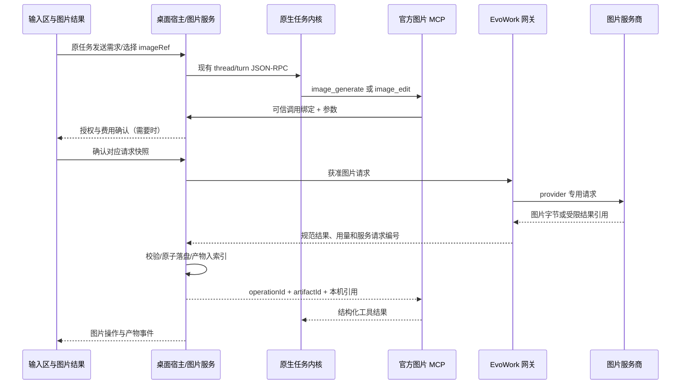

# 真正的 AI 生图与编辑设计

> 状态：**v0.3，单图生成、编辑、连续版本与恢复已实施；验收证据及发布边界见 §15**。
> 确认日期：2026-10-06。用户明确确认十一项全部采纳，已回写总纲 §6.8 / §10.1.9 及相关规则。G0 接缝与 Flash 生成/编辑已验证，Lite/Pro 与 G4 能力边界见 §15。
> 日期：2026-10-06。产品代码基线：`98031d2`；上游只读签出：`d583e73c4d12`。
> 对应：P1「真正的 AI 生图与编辑」、总纲 §6.8 / Q4、详细设计 03 / 04 / 08 / 09 / 10 / 11。
> 阅读建议：先看 §1 的方案和 §13 的确认记录，再看实现细节。§2 保留实施前基线，当前事实以 §15 及 status.md 为准。

## 1. 目标与已确认方案

用户能够在原有任务对话中生成图片，上传或选择已有图片进行 AI 修改，继续追问生成新版本，并把真实图片文件用于报告、PPT、网页等工作产物。

完成标准是：**调用具备图片输出能力的模型，取得有效图片字节，落盘并建立产物记录，重开任务仍能查看和编辑**。SVG/HTML 拼图、绘图脚本、网页截图和模型写出的图片链接可以是其它任务的正常产物，但不能作为本功能已经接通的证明。

首版采用以下已确认方案：

1. 保留当前对话模型负责理解需求、选择工具和检查结果，独立配置图片模型。用户选择 DeepSeek 等对话模型时也能调用已配置的图片服务。
2. 用官方图片技能描述使用方式，用 MCP 工具接入本机图片服务，真实模型请求统一经过 EvoWork 网关。复用任务、审批、密钥库、产物索引和预览，保持内核不可变。
3. 优先验证火山方舟 Seedream 的文生图和单图编辑；OpenAI Images 作为可选适配。具体模型 ID、实际可用能力和费用在接入时验证，不能把任意兼容 URL 当作兼容全部参数。
4. 首版每次生成一张，支持单图自然语言编辑、连续版本、另存与重开。区域编辑、透明背景等按能力提供，能力缺失明确说明。
5. 云端生图默认关闭。用户首次使用确认实际服务、将发送的提示词/参考图和费用来源；同一已授权范围内可复用确认，改变输入或调用范围时重新确认。
6. 不确定是否成功的请求不自动重新生成。先找回本机已保存结果或查询服务商状态，重新调用需用户确认，避免重复收费。

本方案已替代旧设计“复用 `ext/image-generation`，增量成本≈0”的判断，并回写总纲。**Q4 的“本期做图片、视频/3D 暂不做”范围保持不变；采用 B 路线，具体工期在 G0 后估计。**

## 2. 当前能力与缺口

### 2.1 产品代码现状

以下保留 v0.2 实施前代码基线，便于对照设计缺口；实施后的文件及真实模型验收见 §15。

| 位置 | 当前事实 | 需要补齐 |
| --- | --- | --- |
| `services/gateway/src/capabilities.ts` | 能力位有 `imageInput`，没有独立图片输出/编辑契约 | 区分读图、生图、编辑及参数能力 |
| `services/gateway/src/server.ts` | 已有 Responses、模型目录和健康检查，未接图片生成/编辑路由 | 图片服务适配、鉴权、参数验证、错误及用量 |
| `config/config.toml.template` | 使用 `EvoWork Gateway` 和本机 Responses 地址 | 不能把“当前 provider 可聊天”当成可生图 |
| `apps/desktop/src/main/renderer-bridge.ts` 的 `normalizeThreadItem` | 能把原生 `imageGeneration` 的 `savedPath` 或 Base64 转成显示字段 | 验证真实落盘结果、完整失败状态、产物归属和安全预览 |
| `renderer/components/item-renderers.tsx` | 有图片卡；缺图片路径时显示生成中 | 失败/中断不能永远显示生成中；需要编辑入口 |
| `renderer/components/file-preview.tsx` | 已有图片预览、矩形区域批注和百分比坐标 | 区域批注不等于编辑 mask，需独立转换和验证 |
| `services/artifacts` | 有 `image` 类型、技能上报、文件监听、哈希和版本元数据 | 把 AI 图片结果明确归属到任务与操作 |
| `services/kernel-adapter/src/events.ts` | `artifact-scan` 当前由 `fileChange` 触发 | 原生图片 item 或 MCP 成功不能假设自动触发同一产物链 |
| 本轮已落地的任务恢复 | 内核断线、历史恢复、继续任务、失效审批清理 | 图片服务可能已收费但尚未返回，需额外处理结果不确定 |

因此，当前准确说法是“有读图和展示基础”，不能宣称已支持真实 AI 生图/编辑，也不能因已有 `ImageGeneration` 卡片而省略网关、授权和端到端验收。

### 2.2 为什么不能直接启用原生工具

本次在上游签出中核对到四个限制，机器复核记录见设计索引的 F50–F53：

| 核对点 | 证据（相对 `../codex/`） | 影响 |
| --- | --- | --- |
| 工具可见性还有功能开关、provider 能力、读图能力和特定身份门槛 | `codex-rs/core/src/tools/spec_plan.rs:694` | EvoWork 自有 provider/BYOK 不会因为网关新增图片 HTTP 路由就自动获得工具 |
| 图片扩展配置也检查 provider 身份 | `codex-rs/ext/image-generation/src/extension.rs:41` | 不能用改 provider 显示名称或伪造身份作为产品实现 |
| 固定图片模型和工具参数 | `codex-rs/ext/image-generation/src/tool.rs:59`、`:90` | 固定 `gpt-image-2`，引用最多 5 张；没有模型、尺寸、质量、透明背景或 mask 的调用参数 |
| 原生请求独立图片端点且使用 JSON | `codex-rs/codex-api/src/endpoint/images.rs:35`、`:58` | 当前文字 Responses 翻译管道不足以支持它，不能将编辑 multipart 原样当 JSON 转发 |

这些是**静态读码结论**，不是已经完成原生工具与 EvoWork 网关的运行探针。实现前先做 §12 的接缝验证；没有证据时不承诺零改动复用原生工具。

## 3. 首版范围

### 3.1 必须交付

| 场景 | 用户行为 | 可验收结果 |
| --- | --- | --- |
| 文生图 | “给季度报告做一张科技风封面，横版，留出标题空间” | 真实模型图片、本机文件、尺寸/模型信息、产物卡 |
| 单图编辑 | 上传图片后说“保留产品主体，把背景改成浅灰色” | 原图保留，编辑结果另存；没有参考图时不能冒充编辑 |
| 连续修改 | 指定上一版图片，说“背景再淡一些” | 引用指定上一版，新文件关联父版本 |
| 结果复用 | 在任务结果中打开、选作下一次编辑参考、另存到用户选择目录 | 走已有文件授权与预览边界；导出不再调用模型 |
| 跨会话查看 | 关闭窗口/重开 App/重开任务 | 从内核工具历史及本机操作/产物元数据恢复结果 |
| 失败恢复 | 拒绝上传、模型拒绝、断网、超时、崩溃 | 明确状态、可理解的下一步，没有伪造图片和自动重复收费 |

“图片用于 PPT”首版复用现有办公技能插入本机文件，不新建专门的图片作品库或 PPT 编辑器。没有图片理解能力的对话模型可以根据用户参数发起生成，但不能宣称已经视觉检查生成结果。

### 3.2 能力受限的增强项

| 能力 | 建议 |
| --- | --- |
| 区域修改 | 优先复用矩形选区；服务支持位置提示时称“按选区提示修改”，支持 mask 时才称“区域编辑”。不保证选区外逐像素不变 |
| 去背景/透明底 | 服务实际支持该输入与输出组合时开放，展示棋盘格并检测 alpha；普通白底不能标成透明底 |
| 多参考图 | 接口预留，首版默认一张；明确图序和用途，不用“最近几张”猜输入 |
| 多候选图 | 后续开放 2–4 张，并重新核对额度；首版不让模型通过重复调用暗中批量生成 |

### 3.3 本期不做

视频、3D、动画生成、实时协作画布、图层编辑器、任意笔刷/套索、模型训练、LoRA 管理、本机扩散模型安装、对外自动发布或分享、AI 图片自动填充整个资料库。现有图表技能照常使用，但图表不能被算作图片模型验证样本。

## 4. 产品流程

### 4.1 首次配置

“设置 → 模型”增加图片能力分组，沿用现有密钥录入和凭据来源展示。用户配置服务、模型及密钥，点击“验证连接”。

连接验证默认只核对配置、鉴权和服务可达性，**不偷偷生成付费样图**。界面区分“配置有效”“文生图已实测”“编辑已实测”；付费样图验证单独说明费用后启动。没有服务商无费用探测接口时，显示“尚未验证实际调用”，不编造已连接。

状态包括：未配置、未授权、可用、能力未验证、组织已停用、密钥失效、服务不可达。错误仍显示原始可取得诊断，但密钥、请求正文和图片不得进入诊断日志。

### 4.2 文生图

1. 用户在共用 Composer 下达需求；可用插件列表中提供“图片生成与编辑”，不新增独立首页。
2. 任务规划模型调用 `image_generate`，本机服务取得最终提示词和参数快照。
3. 首次或超出已授权范围时显示确认卡：图片服务与凭据来源、最终提示词、一张图片、输出设置、价格上限或“费用未知”、保存位置。用户直接确认的明确图片请求可以形成同一份授权，不再机械弹第二张等价卡。
4. 界面依次显示“等待确认 → 正在生成 → 正在保存 → 已完成”。只显示真实阶段和耗时，不编造进度百分比。
5. 文件落盘和产物入索引后显示图片卡。“另存”“继续修改”“查看详情”沿用 PillButton、菜单、Dialog、文件预览等已登记组件。
6. 用户另存失败不会把成功生成改成失败；模型调用成功但本机保存失败则不能标成已交付。

### 4.3 图片编辑

入口包括 Composer 图片附件、图片结果卡“继续修改”、文件预览“用 AI 修改”。选择输入后显示缩略图、文件名及“将生成新版本，保留原图”。

请求引用稳定 `imageRef`，主进程重新定位原文件并验证哈希。同一对话有多个图片时，必须绑定明确版本；“修改上一张”可解析为最近一次用户选中或成功生成的单张图，仍在提交前展示缩略图。语义不明确时让用户选择，不能静默猜测。

**编辑参考图走独立图片通道**：即使当前对话模型不支持 `imageInput`，已授权图片仍可以发给编辑模型。不要为了绕过现有附件守卫，把原图顺带塞进不支持图片的聊天请求。实现需给附件增加用途区分；只有用户同时要求对话模型看图时才走原有读图链路。

区域修改保留原图像素尺寸、EXIF 方向归一化和预览缩放映射。百分比坐标转换到归一化后的像素坐标并裁剪边界；mask 与输入图尺寸一致，透明/不透明含义由 provider 适配。输入图变化后选区失效，不复用旧 mask。结果对比提供原图/新图切换，首版不新增复杂拖动对比组件。

### 4.4 取消与重试

停止任务先终止当前等待及可取消传输；工具级取消同步到图片操作记录。界面不能承诺服务商已经停止计算或免除费用。

失败卡分别提供“检查配置”“保存已取得结果”“检查结果”“重新生成”等适用动作。重新生成是新操作，提示可能再收费；同一操作重复点击只观察或返回已有结果。任务的“继续任务”先检查图片操作记录，不能凭一句继续把不确定的生成重做一遍。

## 5. 技术路线比较

| 路线 | 优点 | 本轮问题 | 建议 |
| --- | --- | --- | --- |
| A. 原生 `ext/image-generation` + 补网关图片路由 | 原生图片 item、历史与模型输出已有基础 | 特定身份门槛、固定模型、参数不足；普通 BYOK 仍受核心工具门槛限制 | 保留研究入口，不作为首版成立前提 |
| B. 官方技能 + MCP + 本机图片服务 + 网关图片适配 | 国内对话模型可用；密钥、授权、文件和版本可控；无需修改内核 | 需做 MCP 可信调用绑定、结构化结果、宿主接线和端到端验收 | **推荐首版** |
| C. 技能脚本直接请求服务商 | 原型最快 | 易暴露密钥、绕过授权/额度、临时结果与崩溃难恢复 | 仅可做隔离探针，不作为发货链路 |
| D. 新 Rust contributor | 可深度整合原生 item | 当前安装/注册方式需额外验证，且不解决核心专用 namespace 的身份门槛 | 只有 B 无法满足必要契约时再评估 |

新增图片 MCP 属于 Q4 的模型工具，不是恢复 Q9 已排除的飞书/企微等国内办公生态集成。**IMG-Q3 已确认 B 路线，总纲和相关规则已明确允许受控图片 MCP**；该范围不自动扩展到其它办公生态或任意模型连接器。

MCP 路线使用真实 `mcpToolCall` 历史和结构化结果，前端映射为图片展示。不能伪造内核 `ImageGeneration` item 或从 renderer 写入内核历史。

## 6. 分层与调用契约

### 6.1 数据流



这是一项图片工具的交付服务，不另建 agent 执行循环；任务规划、对话压缩、目标预算、审批协议和回合中断继续复用内核。

### 6.2 模块落点（均为待实现）

| 模块 | 职责 |
| --- | --- |
| `plugins/skills/image-generation/` | 生成/编辑场景指令、选图规则、失败不伪造、恢复先查操作；不持有密钥 |
| `plugins/connectors/image-generation/` | MCP 工具声明和宿主调用壳；不直接连接服务商、不持有服务商密钥 |
| `services/image-generation/` | 本机操作生命周期、授权快照、图片校验、文件提交、恢复与产物关联 |
| `services/gateway/src/images/` | provider 请求适配、凭据/策略解析、受限网络请求、响应与用量规范化 |
| `services/store/` | 图片操作元数据迁移和 repository；不存图片 Base64/提示词正文 |
| `services/kernel-adapter/` | MCP 调用上下文、审批和历史读取；唯一内核协议边界 |
| `apps/desktop/src/main/` | 端口接线、secretStore、文件授权、事件和语义 IPC |
| `apps/desktop/src/renderer/` | 图片配置、确认、状态、图片卡、编辑与恢复入口；不取密钥、不出网调模型 |

新增目录配 README。共享请求/结果类型可放跨层包，provider 特有类型只留在网关。所有路径为提议，不表示目录已经存在。

### 6.3 工具与内部请求

建议工具分为 `image_generate`、`image_edit`、`image_operation_status`。最后一个只读，必须限定到当前任务；状态查询不触发再次生成。模型不传 API Key、上游 URL、任意输出路径或自选计费账号。

示例为 EvoWork 内部语义，**不是任何厂商 API 的原样参数**：

```ts
type ImageToolInput =
  | { kind: 'generate'; prompt: string; aspectRatio?: string; background?: 'opaque' | 'transparent' }
  | { kind: 'edit'; prompt: string; imageRefs: string[]; regionRef?: string };

type ImageCallContext = {
  operationId: string;  // 宿主创建；同一次调用稳定，跨重连可查询
  threadId: string;     // 协议/宿主可信上下文，不取自工具 arguments
  turnId: string;
  callId: string;
  kernelGeneration: number;
  approvedRequestHash: string;
};

type ImageToolResult = {
  operationId: string;
  status: 'completed' | 'failed' | 'cancelled' | 'outcomeUnknown';
  artifacts?: Array<{ artifactId: string; imageRef: string; path: string; width: number; height: number }>;
  errorCode?: string;
  retryCreatesNewCharge?: boolean;
};
```

宿主解析实际图片模型、尺寸、质量、输出格式和数量。默认一张。任何参数调整在授权前明确展示；不支持的显式参数返回错误，不能悄悄去掉透明背景、mask 或换模型。

MCP 身份取自受控注册进程和内核注入的 `_meta`，并与 adapter 所知活动回合、工具调用及审批快照绑定。MCP 消息中的任务 ID 本身不是完整授权证明；无法唯一对应当前调用时拒绝。宿主通道使用进程级随机凭据、受限本机端口/套接字、长度限制和连接代次，模型参数不能自证身份。具体 metadata/callId 接线必须在 G0 验证，不能按假工具元数据直接发货。

### 6.4 网关接口

建议新增已鉴权的内部图片能力目录与图片操作端点，复用模型四层合并、组织禁用、`byok / hosted / private` 和密钥库。命名暂拟：

- `GET /v1/evowork/image-models`：图片目录、凭据来源、能力及验证记录。
- `POST /v1/evowork/image-operations`：获准操作的 provider 调用；接受受限字节/编码输入，不接受任意本机路径。

图片网关返回结果采用有上限的二进制响应或受限编码，不让 renderer 收到大 Base64。若 provider 返回 URL，由适配层执行受限下载或转交本机受限下载器；不能让 UI 直接加载远端 URL。

取消、查询只能在 provider 确实支持时映射；没有上游查询能力就保留“结果未知”。第一版不承诺通用远端 job ID，也不把同步 API 包装为可跨进程恢复的远端任务。

## 7. 模型能力与服务商

### 7.1 图片目录独立于聊天模型

建议能力描述为结构，而不是增加一个万能 `imageOutput: true`：

```ts
type ImageCapabilities = {
  generate: boolean;
  edit: boolean;
  regionGuidance: boolean;
  maskEdit: boolean;
  transparentGenerate: boolean;
  transparentEdit: boolean;
  maxInputImages: number;
  maxOutputImages: number;
  inputFormats: string[];
  outputFormats: string[];
  supportedSizes: string[];
  supportsCancel: boolean;
  supportsLookup: boolean;
  supportsIdempotency: boolean;
};
```

每项记录 `documented / verified / unsupported / unknown`、核对日期和限制说明；透明背景还需描述输入前提。文档支持不等于当前账号已开通。连接成功、生成成功和编辑成功分别验证；能力未知时不在正式入口承诺支持。

DeepSeek 等现有对话模型配置可用于编排测试，**不能推导出图片生成权限或复用为另一家图片服务的凭据**。工具调用能力与视觉输入能力也分别判断。

### 7.2 候选适配与推荐顺序

| 适配 | 已取得的官方依据 | 提议与验收边界 |
| --- | --- | --- |
| 火山方舟 Seedream | 官方图片 API 列出文生图、单/多图输入和编辑；不同版本的流式/组图能力不同 | 推荐先验证单图生成与单图编辑，适合现有国内模型工作流；不能把框选提示等同于像素 mask，透明背景条件需单独实测。依据：[官方图片 API](https://docs.volcengine.com/docs/ark/image-generation-api?lang=zh&redirect=1) |
| OpenAI Images | 官方区分生成与编辑接口，支持参考图和 mask；mask 是引导而非选区边界的精确保证 | 可选适配，先用 Images API，避免为了生图把整个对话改接 Responses；具体型号、账号权限和格式参数实施时固定并实测。依据：[图片指南](https://developers.openai.com/api/docs/guides/image-generation)、[编辑参考](https://developers.openai.com/api/reference/resources/images/methods/edit) |
| 企业私有图片服务 | 当前没有提供可验证的图片 endpoint | 复用目录和凭据分层，但按已验证协议提供适配；任意“OpenAI compatible”标签不自动开启编辑/透明背景 |

以上 API 文档于 2026-10-06 核对；火山页面经本机浏览器读取。没有执行付费生成、没有取得图片服务真实 Key，因此**不是模型质量、可达率或当前账号可用性结论**。不将价格和“最新型号”写死在产品逻辑中。IMG-Q1 已确认 Seedream 优先；首个实际 model ID 按账号开通情况与生成/编辑探针固定。

## 8. 数据、文件与版本

### 8.1 文件是真源

默认写入任务真实 `cwd` 下的 `artifacts/images/<operationId>/result.<ext>`；暂存同目录的 `.partial` 文件，通过完整解码、格式/尺寸/大小检查后原子提交。没有项目的任务使用现有私有任务工作目录，不额外要求用户先建项目。

保存不覆盖原图。新文件路径避免冲突，预先检查真实路径和软链；写入前复核授权范围，提交后同步文件与目录持久性。操作成功但索引失败时状态留在“正在保存/交付未完成”，恢复后从本机提交记录补索引，不重新请求服务商。

图片通过主进程授权后的现有预览数据或受控本机资产协议显示，不能把任意绝对路径直接当浏览器资源。正式实现前核对图片卡、lightbox/文件预览和删除后的缓存失效。

### 8.2 图片操作记录

建议本机新增 `image_operation`，首版字段按迁移细化：

| 字段组 | 内容 |
| --- | --- |
| 身份与归属 | `id, thread_id, turn_id, call_id, kernel_generation, parent_operation_id` |
| 请求快照 | `kind, image_model_id, credential_source, request_hash, input_refs/hashes, normalized_options` |
| 生命周期 | `status, created_at, submitted_at, completed_at, error_code, cancellation_requested` |
| 结果 | `provider_request_id`（可取得时）、`artifact_ids, output_paths/hashes, delivered_count` |
| 费用 | `reserved_image_count, actual_image_count, currency, quoted_max_cost, actual_cost, cost_state` |

唯一约束至少覆盖可信的 `(thread_id, turn_id, call_id)`，同一调用重复请求返回已有记录。用户点“重新生成”才创建新 operation；不能由模型通过换 operationId 绕过既定额度。

数据库、审计和运行日志不存图片 Base64、原始提示词或完整服务商响应。请求正文需要恢复时，从既有内核工具历史按协议读取；模型工具历史可能包含提示词，必须沿用任务历史留存/删除规则，不能宣传“完全不落盘”。授权详情只是界面展示，结构化日志只记枚举、用量和受限标识。

### 8.3 新图与父版本

沿用现有 `artifact` 索引的类型、哈希和文件状态。同一路径的变更仍按现有版本规则计算；本功能选择新文件保留原图，因此**跨文件的编辑关系由 `parent_operation_id` 和输入 artifact 引用表达**，不强行复用同路径版本号。

重开历史时以文件存在性和内容哈希为准。文件已移动/删除时显示“文件不可用”，不因曾成功生成而无限展示缓存；允许重新选图，但不能未经确认去服务商重新生成。

## 9. 隐私、授权和费用

### 9.1 新增出网登记（已确认并回写总纲 D9）

| 数据流 | 会发送什么 | 明确不发送 |
| --- | --- | --- |
| 图片调用：本机图片服务 → 本机/私有/托管网关 → 选定图片服务商 | 最终提示词、明确选中的参考图/必要 mask、输出参数和调用标识 | 整个工作目录、未选择的图片、完整聊天历史、日志、任意凭据 |
| 结果下载：网关或本机下载器 → provider 结果存储域 | 取得结果所必需的受限 URL 请求 | 不相关域 Cookie、API Key 或其它用户文件 |
| 另存、缩略图、尺寸/alpha 检查、mask 构造 | 本机处理，不出网 | 不增加云端解析/OCR 回退 |

该登记不会自动授权真实调用。企业 deny 优先；“完全访问”不等于批准上传任意文件或无限图片费用。更换 provider、BYOK/托管来源、输入图或提示词用途超出原授权范围时重新确认。任务/操作归属标识保留在本机；provider 调用只传接口必要标识，不将本机任务身份附加到厂商请求或聚合计量中。

授权覆盖最终请求快照：目的服务、任务、输入内容哈希、提示词哈希、参数、数量、保存位置、有效期及费用上限。确认后图片被修改则授权失效。图片读取和编辑上传分别验证；允许本机读取不等于允许发给云端。

图片上传尽量去掉非必要 EXIF/定位元数据，并告知重编码行为。保留原图文件，不因本机清洗破坏用户源图；图中可见文字/人脸等内容仍会上传，不把去 EXIF 描述成匿名化。

### 9.2 密钥与网络

复用 `safeStorage`，服务商密钥仅在网关受控进程取得。渲染层、MCP 工具结果、脚本参数、日志与图片元数据不得包含密钥。钥匙串不可用遵循现有明确选择规则，不另开默认明文存储。

provider 目标只能来自用户/组织已配置服务，不取模型任意 URL。默认 HTTPS；私有 HTTP 仅按组织显式部署规则允许。结果 URL 校验 scheme、目的地址、DNS/重定向与大小，拒绝回环/内网/元数据服务等未授权目标，重定向不携带上一域凭据。采用 Base64 返回可以减少下载域问题，但仍需严格解码与大小上限。

### 9.3 费用与限额

图片调用有独立图片计数/金额上限。原生 `ThreadGoal.tokenBudget` 继续限制对话编排，**不能把图片费伪装成聊天 token，或宣称已有 Token 预算覆盖图片花费**。

首版建议每次一张、每任务最多四次付费图片调用、每用户一个图片操作在途；用户可明确追加额度。数量限制可以先实施，金额预留必须有可靠报价才算硬限制。价格未知时提示“服务商计费，费用暂不能确认”，首次调用必须显式接受，不显示 0 元。

提交前预留次数/可计算的费用上限，完成后按实际返回计量。拒绝发生在出网之前不计调用；已经提交但结果未知则保留预留或转为不确定消费，不能自动退还额度后继续生成。取消不承诺退款。账号/租户计量、BYOK 与托管画像沿用现有凭据来源语义，v1 不新增充值/支付入口。

## 10. 生命周期与失败恢复

```text
prepared → awaitingApproval → submitting → running → saving → completed
              ↓                 ↓           ↓         ↓
           cancelled         failed    outcomeUnknown failed
```

`outcomeUnknown` 表示服务可能已接受/收费但本机无法证明结果；不是普通可重试错误。授权等待不占用服务商执行名额，提交至交付期间持有并发名额；终态释放。异步 provider 可增加受控轮询阶段，同步 provider 不虚构该能力。

| 触发 | 恢复规则 | 用户看到什么 |
| --- | --- | --- |
| 审批拒绝/到期 | 未出网、撤销临时请求与预留 | 已取消，未提交图片请求 |
| 提交前连接失败且可证明请求未发送 | 可保留草稿，手动重试；若无法证明则按未知处理 | 未提交 / 结果待确认 |
| 服务商拒绝、401、额度不足、参数错误 | 明确失败，不换 provider、不改请求绕过拒绝 | 对应原因和配置/额度入口 |
| 429 或 5xx | 不默认重放可能产生费用的 POST；只有 adapter 证明未受理或支持有效幂等契约才可有限重试 | 限流/服务错误或结果未知 |
| 已提交后超时/连接中断/进程退出 | 标记未知；有可靠 request/job ID 才查询；没有则等待用户选择 | 可能已计费，不会自动再生成 |
| 已取得图但保存失败 | 在受限暂存仍完整时只重试本机保存 | 图片已生成，保存失败 |
| 文件落盘后、索引或 MCP 回复前崩溃 | 按操作提交记录验证文件，补索引/补 UI；旧回合已结束时不伪造迟到完成事件 | 已找回本机结果 |
| 内核重启，宿主仍收到旧请求结果 | 宿主可保存已获准的结果到原任务，但不能发起新请求或回复新连接的同号调用 | 原任务有已找回图片；新回合不被旧回复污染 |
| 用户取消/任务删除期间结果迟到 | 撤销交付；按操作代次及删除标记清理临时文件，不能重建已删历史 | 已取消 / 已删除；费用仍按实际结果记录 |

每个 provider 明确 `supportsLookup / supportsCancel / supportsIdempotency` 的真实语义和期限。不能因为本机 operationId 去重，就对外承诺服务商恰好执行一次。底层 HTTP 客户端/网关代理的自动重试也要纳入验收。

主动后台补查只能取得既有结果，不能重新提交生图。IMG-Q8 已确认首版仅交互根任务，自动化与子任务不能自行发起图片付费/上传；未来开放需另行确认显式预授权。Q8 的定时任务失败不自动重试继续有效。

## 11. 限制、错误与留存

建议默认限制：一张输入、20 MiB 输入、32 MiB 输出、1600 万像素；以 provider 更小的限制为准。检测文件签名、真实解码格式、尺寸和图像炸弹；首版输入 PNG/JPEG/WebP，GIF/SVG 不隐式转为编辑输入。输出格式取实际数据，不把 JPEG 文件伪标成 PNG。

保留输出所带 provenance/水印信息，不自行去除 provider 水印。界面标注“AI 生成”及服务、模型、时间；提示词详情可折叠。内容拒绝如实展示，不自动换服务绕过。图片中的文字/元数据属于内容，不能成为新的工具授权指令。

操作元数据跟随任务历史留存；缩略图、mask、上传副本和暂存均登记归属并清理。建议未提交临时内容终态立即清理，崩溃遗留暂存最长保留 24 小时供找回；不得影响用户原图和成功产物。删除任务默认沿用既有文件语义，新增“删除图片工作副本/缓存”需解释范围；删除索引不等于删除用户产物。任务删除标记必须阻止迟到回调重建数据。

需要本地操作恢复元数据不等于允许备份云端图片。首版不自动备份输入图、mask 或结果；分享仍走现有独立授权链路。服务商的数据留存/训练设置显示其实际配置或“未核实”，不能承诺所有服务零留存。

## 12. 实施切片与验收

| 阶段 | 交付 | 放行条件 |
| --- | --- | --- |
| G0 契约验证 | 原生工具门槛探针、MCP 可信调用/取消接缝、首个 provider 图片生成与编辑探针 | 发货内核能调用拟定工具；可信 thread/turn/call 绑定可证明；真实 provider 生成和编辑均返回可解码图片 |
| G1 生成交付 | 图片模型设置/目录、授权、网关适配、单图生成、本机落盘、产物与图片卡 | 真模型生成，本机文件可用；拒绝后零出网；重开仍可查看 |
| G2 编辑交付 | 独立编辑附件、稳定 imageRef、连续版本、原图保留、另存 | 真模型利用参考图完成修改；不串版本；不能读图的聊天模型仍能调用编辑工具 |
| G3 恢复与预算 | 本机操作记录、并发/费用、未知结果、取消、历史删除、断线恢复 | 重复点击与崩溃不自动重复生成；迟到结果不污染新连接；所有额度/取消语义可观察 |
| G4 按能力增强 | 区域提示或 mask、透明背景、多参考图/多候选 | 每项独立真实验收，缺失能力有明确提示，不自动降级 |

P1 最小发布切片为 **G0–G3**。IMG-Q4/Q5 已确认区域编辑与多图进入后续切片，透明底仅 G4 能力实测通过后显示，不作为基础首版必备。G0 核心探针现已通过，具体证据见 §15；不沿用“增量成本≈0”，不以单轮样本推定后续能力成本。

### 12.1 确定性测试

用本机假服务控制成功、畸形 Base64、空结果、伪 MIME、超大响应、输入被替换、403/401/429、连接中断、原子提交及索引故障。断言实际网络次数、文件内容和归属、额度占用、审批先后，不只断言 UI 文字。

重点覆盖：拒绝时零图片上传、跨任务 imageRef 拒绝、旧审批不能批准新快照、同 callId 并发去重、未知请求不能自动重发、重复另存不收费、任务删除后迟到结果不复活。新接口还需验证鉴权、组织 deny、主进程/renderer 接线完整和密钥不进入 IPC。

### 12.2 真内核、真窗口和真图片模型

至少以下旅程通过后才显示正式可用：

1. 文生图 → 确认 → 真图片文件 → 本机预览/另存 → renderer 重载及 App 重启。
2. 上传测试产品图 → 编辑背景 → 继续改上一版 → 原图哈希不变、每版输入/父版本正确。
3. 一个不支持读图但支持工具的对话模型调用图片编辑服务，原图不进入聊天 provider 请求。
4. 拒绝上传、组织停用、密钥错误、余额/限流和内容拒绝，均没有换模型/服务的隐式调用。
5. 执行期间取消、内核/宿主/网关分别退出；校验调用次数、费用状态及本机恢复结果。
6. 所宣称的区域编辑、透明底逐项验收；透明底检测非全不透明 alpha，编辑以测试目标变化及主体保留评估，不能只看 HTTP 200。

真模型样本使用可公开合成图片，用户提供的真实凭据仅经安全测试环境进入进程，不写文档/仓库/测试报告。生成后必须人工或独立视觉检查内容，不能用尺寸、非空字节当成质量验收。建议每项核心场景重复至少三次，记录成功率、耗时和费用；单轮失败保留原始分类，不重跑后抹掉失败。

最终跑 `pnpm run check`、完整构建和相关真窗口回归，检查打包后的 MCP 独立启动、网关端点和文件权限。文档完成不等于此发布闸门已通过。

**打包要求（IMG-Q3 已确认；实施/验收见 §15）**：图片技能、权限声明和 JS MCP 入口随产品分发，使用 Electron 自带 Node，不运行时拉包。本机服务与网关适配纳入现有构建/宿主启动；独立目录启动、干净安装和既有配置升级均须验收。安装后图片云端能力仍默认关闭，不触发付费样图或图片上传。

## 13. 已确认决策与建议依据

**2026-10-06 用户确认：IMG-Q1/Q2/Q3/Q4/Q5/Q6/Q7/Q8/Q9/Q10/Q11 均采纳建议。** 下表保留原问题及建议依据作为决策记录，不再作为待确认项；产品决策已完成，接缝和实际服务能力仍按 §12 验证。

| 编号 | 原确认问题 | 决策（采纳原建议） | 对实现的影响/建议依据 | 确认结果 |
| --- | --- | --- | --- | --- |
| IMG-Q1 | 首个图片服务用谁？ | **火山方舟 Seedream 优先，OpenAI Images 可选**；具体型号以账户可开通且生成/编辑探针通过为准 | 决定参数、可达区域、编辑能力和测试凭据；只配置 DeepSeek 无法完成真实图片验收 | ✅ 已确认：采纳建议（2026-10-06） |
| IMG-Q2 | 凭据来源是用户自带、组织托管，还是产品提供免费额度？ | **首版 BYOK 或已有组织私有服务**；不承诺免 Key/免费生图，之后再接托管 | 托管需要服务端授权、计量与成本承担；不能复用此前搜索“免配置”的结论 | ✅ 已确认：采纳建议（2026-10-06） |
| IMG-Q3 | 是否同意技能 + 图片 MCP + 本机服务 + 网关路线，并扩展当前仅 browser 的工具范围？ | **同意 B 路线，限定 Q4 图片工具**；总纲、目录与打包要求已同步 | 不改内核，新增受控模型通道；不同意则先做原生可用性/扩展安装探针再定路线 | ✅ 已确认：采纳建议（2026-10-06） |
| IMG-Q4 | 首版“编辑”需要全图自然语言修改，还是必须区域 mask/去背景？ | **必须单图自然语言编辑和连续版本；区域编辑按能力进入下一切片** | 若 mask 必须首发，则首个 provider 必须实际支持且通过 G4，不能只上线提示词框选 | ✅ 已确认：采纳建议（2026-10-06） |
| IMG-Q5 | 透明背景、多参考图与多候选是否首发？ | **一张输入、一张输出；透明底仅在能力实测通过后显示** | 批量/透明参数与服务价格差异明显，需要独立控件和验收 | ✅ 已确认：采纳建议（2026-10-06） |
| IMG-Q6 | 云端发送提示词/参考图的确认可复用到什么范围？ | **首次配置说明不代替上传授权；按任务、provider、输入哈希和数量/金额限额复用具体授权** | 每次都弹卡更打断；持久授权更宽，需要额外政策、有效期和撤销机制 | ✅ 已确认：采纳建议（2026-10-06） |
| IMG-Q7 | 默认调用次数与金额上限是多少？ | **每次一张、每任务四次、一个在途；可靠价格可得时再加金额上限** | 无价格时不可宣称费用硬上限；重新生成和未知结果需占用额度 | ✅ 已确认：采纳建议（2026-10-06） |
| IMG-Q8 | 自动化或子任务是否允许付费生图/上传？ | **首版只允许用户交互发起的根任务**；未来按明确预授权开放 | 无人值守需要预算、输入范围和撤权规则；Q8 不自动重试不能被绕过 | ✅ 已确认：采纳建议（2026-10-06） |
| IMG-Q9 | 是否接受直接连图片服务的显式云端模式？是否有强制私有部署要求？ | **保持本机默认关闭，提供明确选择；有私有要求则只列组织允许 endpoint** | 完全离线且无本地图片模型时，应如实不可用，不用脚本合成图补位 | ✅ 已确认：采纳建议（2026-10-06） |
| IMG-Q10 | 图片/上传副本/临时 mask 随任务删除怎样处理？ | **保留用户原图与成功产物，清理工作副本和缓存；崩溃暂存保留至多 24 小时** | 若要求连产物一并删除，必须提供明确范围、恢复/确认与历史删除验收 | ✅ 已确认：采纳建议（2026-10-06） |
| IMG-Q11 | 是否需要一键覆写原图？ | **首版不覆写，另存新版本** | 能降低恢复歧义并保留对照；若加入覆写，要走现有覆盖审批与备份规则 | ✅ 已确认：采纳建议（2026-10-06） |

已确认组合：**Seedream + BYOK + B 路线 + 单图生成/自然语言编辑/连续版本 + 具体范围云端授权 + 四次额度 + 仅交互根任务 + 原图不覆写**。区域 mask 与多图进入后续切片，透明底通过独立能力实测再显示；托管额度不因确认基础方案自动开启。

## 14. 依据与后续文档同步

本地设计依据：[总纲 §6.8 / Q4](../evowork-on-codex-design.md)、[任务工作台](04-task-workspace.md)、[产物与解析](08-artifacts-and-ingest.md)、[服务层](09-service-layer.md)、[安全权限](10-security-permissions-ux.md)、[模型管理](11-account-and-models.md)、[当前状态](../status.md)。

外部依据为 §7 所链的官方 API 页面；OpenAI 的 [Responses 图片工具指南](https://developers.openai.com/api/docs/guides/tools-image-generation) 作为路线 A 对照。本文未使用第三方博客作为接口契约，也未按公开文档推定账号实际开放能力。

**v0.2 同步记录（2026-10-06）**：已回写总纲 §6.8、Q4、§10.1.9 的路线/成本与 D9 出网登记；已同步 03 的图片编辑附件、04 的图片卡/恢复、08 的结果索引和版本、09 的操作元数据、10 的上传/额度、11 的图片能力目录，以及设计索引、插件目录和跨会话规则的允许范围。status.md 只登记产品决策已确认、实现尚未开始。不得把决策确认或静态读码标成图片功能已完成。

## 15. 首版实现与验收记录（2026-10-06）

### 15.1 已实施核心链路

- 官方 `image-generation` 技能编排同名 MCP。`image-host.ts` 用适配层真实在途 MCP item 的 thread/turn/call、参数及进程代际绑定身份，仅允许交互根任务；内核重启轮换本机令牌。没有新增执行循环或内核修改。
- 图片模型独立配置，Ark 密钥进入既有 safeStorage 密钥库。图片云端功能默认关闭；每次生成/编辑均展示最终提示词、所选文件、型号、服务地址、自带凭据和未知金额，完全访问不代答费用确认。“验证型号与凭据”只读服务商目录，不生成样图。
- PNG/JPEG/WebP 编辑输入限制收紧至 **10 MiB**、1600 万像素，原生解码前检查签名与尺寸，随后标准化为新 PNG 副本。动画输入拒绝。图片字节只走图片网关，不进不支持读图的聊天 provider 请求。
- 网关 `images.ts` 提供已鉴权的图片目录和单次图片操作：单张 2K PNG、保留服务商水印，不下载任意结果 URL、不重定向、不重试、不隐式换模型。已有模型停用及图片总开关优先拒绝。
- `services/image-generation` 完成按 call 去重、同 call 内容变更拒绝、默认四次付费请求/一个在途、未知结果阻断及明确风险确认、原子文件落盘/索引、本机保存恢复、取消/删除后的迟到结果隔离。权威库 v4 增加 `image_operation`，v3 升级先备份；投影重建不删除图片操作。
- 每个生成/编辑版本保存在 `artifacts/images/<operationId>/result.png`，结果区和图片卡可预览、打开与继续修改，原图不覆盖，连续版本记录父操作。启动只恢复本机交付，已提交失联请求显示“结果未知，可能已计费”，不会重放。删除任务清理规范化副本及在途暂存，成功用户文件保留。
- 操作表不存提示词、Base64 或密钥；内核工具历史仍按既有任务留存规则处理，不能宣传“完全不落盘”。

### 15.2 实际型号及真实模型样本

接口为用户指定的火山方舟 Ark `https://ark.cn-beijing.volces.com/api/v3/`。真实账号只读 `GET /models` 返回 200，以下三个型号均在目录中。目录可用不等于已验收全部出图能力。

| 用户名称 | 实际请求型号 | 本次实测 |
| --- | --- | --- |
| Doubao-Seedream-5.0-flash | `doubao-seedream-5-0-flash-260915` | 一次生成白底红球，随后一次编辑为蓝球；两次均成功取得可解码的 2048×2048 PNG，独立视觉检查确认颜色变化及构图保留 |
| Doubao-Seedream-5.0-lite | `doubao-seedream-5-0-260128` | 仅目录验证，未发起付费出图/编辑样本 |
| Doubao-Seedream-5.0-pro | `doubao-seedream-5-0-pro-260628` | 仅目录验证，未发起付费出图/编辑样本 |

真实样本通过同一网关适配器执行，共 **两次图片 POST**；生成约 2.94 MB、编辑约 3.52 MB。实际费用未取得，未将公开价格当成本次账单。密钥经隐藏 stdin 进入测试进程内存，未写入仓库、参数文件、报告或日志，也未替用户启用常用配置。单对样本不代表稳定率或质量保证。依据：[官方图片 API](https://docs.volcengine.com/docs/ark/image-generation-api?lang=zh&redirect=1)、[官方 Seedream 型号说明](https://docs.volcengine.com/docs/ark/seedream-4-0-5-0?lang=zh)。

### 15.3 确定性验证与可复跑入口

`pnpm run test:images-e2e` 构建并运行真 Electron、发货 app-server、图片 MCP 与本机确定性图片网关。已通过生成、连续编辑、上传 JPEG 后编辑、原图不变、具体费用确认前零请求、拒绝零请求、产物索引/预览、非视觉聊天模型不接收图片字节、renderer 刷新及内核重启后保留记录与预览、零重放。此回归的三次图片调用是本机夹具，不与上节两次真实付费样本混计。

专项测试覆盖有界输入/输出、HTTP 鉴权、型号目录只读验证、错误脱敏、组织停用、请求去重、未知费用、额度、跨任务引用、文件变更/软链、取消/删除的迟到响应、有效 partial 的本机恢复、v3 权威库升级及图片卡交互。完整构建还从无 workspace 的临时目录启动图片 MCP，验证两个工具均可独立发现。全仓检查最终结果登记在 status.md。

### 15.4 仍需验收与后续范围

- Lite/Pro 尚无真实出图/编辑样本；Flash 仅一对样本，§12.2 建议的各场景重复三次与费用统计尚未完成。真实图片服务探针与确定性真窗口回归分别验证服务契约和产品接线，尚未跑结合真实聊天模型、真实图片模型与人工窗口操作的完整旅程。
- 已验证 renderer 刷新、内核重启及服务重新创建时的本机恢复；正式安装包干净安装、已有安装升级、整 App 退出后重开及 Windows/Linux 实机仍待验收。现有 Computer Use 签名/发布闸门保持不变。
- 本轮提供 Seedream BYOK、已有模型禁用与图片总开关；组织私有图片服务、强制 endpoint 白名单和托管计量的完整部署/模型分层验收尚未完成，不能宣称支持任意私有兼容服务。
- G4 的区域 mask、透明背景、多输入/多候选，以及 OpenAI Images 适配和视频仍未实现；设置/技能只声明当前单图 2K PNG 范围。
