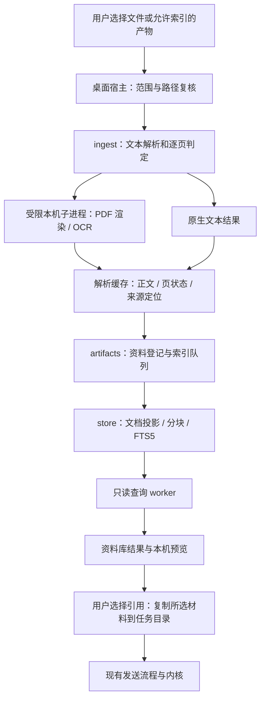

# 扫描件 OCR 与资料库正文检索设计

> 状态：**v0.3，OCR-Q1–OCR-Q12 已全部确认，本地首版已实现；发布验收未完成**。
> 日期：2026-10-06。产品实现基线：`c74b608`（文档写入时 HEAD 为 `33a7bf9`，仅新增语音输入设计）；上游只读签出：`d583e73c4d`。
> 对应：P1「扫描件 OCR、资料库正文检索」；总纲 K1/K2/K6、D6/D9、Q3/Q17/Q19/Q26，以及详细设计 03/06/08/09/10。
> 阅读顺序：§1 已确认范围 → §3 使用流程 → §12 已确认决策 → 技术与验收细节。
> 初稿阶段只核对现有代码与官方技术资料，没有执行 OCR 样本、安装包或正文检索性能测试。用户于 2026-10-06 明确确认 OCR-Q1–OCR-Q12 均采纳建议，已回写总纲 §10.1.10 及关联设计。本文 §1–§12 的限制、阈值与性能数字为已确认默认值或验收目标；2026-10-06 实现与实测边界另见 §14，不将合成样本结果外推为所有真实文件或平台均已验收。

## 1. 目标与已确认首版

用户添加扫描 PDF 或图片后，EvoWork 能在本机识别文字、保留页码与原文件来源，并将可检索正文用于当前任务或用户明确加入的资料库。用户在资料库搜索正文中的词，即使文件名没有这个词，也能找到相关文件、查看命中片段、打开对应页或段落，并选择引用到任务。

首版采用 **本地 OCR + 统一解析缓存 + SQLite FTS5 + 受控资料登记** 完成首版。OCR 和检索均不需要模型 API Key；不修改内核，不引入云 OCR、云索引、向量服务或新的智能体执行循环。

首版范围已确认包含：

1. 扫描 PDF、混合 PDF 的逐页判断与 OCR；PNG/JPEG/静态 WebP 图片的显式“识别文字”。普通读图和 AI 图片编辑入口保持各自语义。
2. 简体中文与英文印刷体，保留页级文本、识别来源及质量提示；支持旋转页，原文件不覆写。
3. 文本/Markdown、PDF、现代 Office 文件的正文索引；扫描件正文来自同一 OCR 结果。全文索引不能只取当前附件摘要或表格预览。
4. 当前可见本地产物、用户通过“添加资料”导入的本机副本，以及用户选择加入资料库的任务附件。仅为当前任务添加的附件不默认变为跨任务资料。
5. 文件名与正文统一搜索，类型/来源/项目筛选，命中片段、页码或段落定位，分页与取消，选择后引用到 Composer。
6. 可观察的后台处理、部分结果、停止/继续、增量更新、源文件变更与删除同步、缓存清理及离线组件安装。

不作为首版承诺：手写识别、印章/签名鉴真、数学公式结构化、复杂表格重建、原版排版复原、批量可搜索 PDF 导出、全盘扫描、团队订阅、语义问答/同义词召回、自动读取整个资料库、云端 OCR。

## 2. 设计前基线与实施落点

本节保留设计时核对的基线；本次实现与实测边界见 §14。

| 位置 | 当前事实 | 本次需要补齐 |
| --- | --- | --- |
| `services/ingest/src/runtime.ts`、`probe.ts` | 有 `ocr` 档，探针只检查 `pytesseract` 能否导入，解释器仍来自办公档 | 检查真正的 OCR 可执行文件、共享库、语言包、渲染器与识别样本；导入包装库不等于能识别 |
| `services/ingest/src/detect.ts` | PDF 文件头统一识别为 `pdf`，没有扫描页或混合页判断；图片直接透传 | 在 PDF 解析内部逐页判断；独立增加显式图片 OCR 意图，不能仅改扩展名映射 |
| `services/ingest/src/parsers/office.py` | PDF 提取文本层和表格，没有 OCR；每页均写入“第 n 页”标题 | 不能把生成的页标题当作有效正文；空白页、扫描页、文本层乱码分别处理 |
| `services/ingest/src/pipeline.ts`、`inject.ts` | 已有本机上传、`content.md`/`meta.json` 与路径/摘要/关键图片注入；摘要上限 200 字、关键图片最多 4 张 | 复用解析与注入；增加页级结果、取消与结构化错误、索引交接，正文检索不局限于摘要 |
| `services/ingest/src/parsers/office.ts` | 支持 Office/PDF 文本层外部子进程，移除代理变量；注释明确 OS 沙箱尚未接 | 环境变量清理不能证明禁止网络；OCR 上线需真实验证子进程网络/文件隔离 |
| `services/runtime-installer`、`apps/desktop/src/main/local-services.ts` | 实际安装/状态入口只有办公档；OCR 档尚无二进制与语言包清单 | 可搬运的 OCR 包、哈希/版本戳、原子安装、在线/离线安装与实际识别探针 |
| `services/store/src/schema.ts` | 已建 `library_node` 和 FTS5 `library_index`，正文使用 trigram；`meta` 列为 UNINDEXED | 文档/分块元数据、生产写入方、查询仓库、投影迁移及重建；元数据若需搜索必须有显式索引字段 |
| `services/store/test/migrate.test.ts` | 测过 FTS 中文与短词回退的 SQL 原语 | 不等于生产正文索引/搜索链路已接通 |
| `services/artifacts/src/library.ts`、`apps/desktop/src/renderer/views/library.tsx` | `filterRows` 只对文件名做包含匹配；界面明确“搜索文件名” | 主进程正文搜索、命中片段与处理状态；不能改提示词后仍在前端过滤文件名 |
| `apps/desktop/src/main/renderer-bridge.ts` 的 `getLibrary` | 当前从产物表折叠版本、返回仍存在的产物；没有完整“我的资料”导入动作 | 最小受控导入/登记、正文状态与搜索 IPC；不把尚未接通的团队空间带进首版 |

已核对上游文件搜索协议，现有 Composer 文件搜索也经过适配层。它解决文件候选，不替代本机资料正文索引。本文不新增内核 `path:line` 断言或修改内核存储。

## 3. 用户流程

### 3.1 扫描件用于任务

1. 用户选择/拖入 PDF，已有办公解析先读取文件结构与页级文本。图片仍按原读图流程添加，用户另选“识别文字”才启动 OCR。
2. 发现疑似扫描页且 OCR 组件未安装，显示“需要安装本地 OCR 组件”，给出下载体积、安装/取消/以原始文件引用。拒绝安装后不反复弹窗，也不上传云端。
3. 安装与识别是两项状态。运行时已安装且用户已允许此文件本地识别时，按页处理扫描页；原生文本页直接使用文本层。
4. 附件显示真实进度，如“已处理 8/20 页，1 页识别失败”；未得到总页数时只显示正在检查。用户可停止，之后继续剩余页。
5. 全部成功，或用户明确选择“使用已完成部分”后，发送摘要和解析文件路径。部分结果的缺页、范围与 OCR 质量提示必须随引用进入任务。
6. “加入资料库，供以后检索”单独选择，默认不勾选。取消任务发送不自动使暂存附件进入跨任务搜索。

普通 PDF 首次触发自动 OCR 时展示一次本地识别说明，可记住该本地处理偏好；它不授权向聊天模型发送图片，不授权把附件加入全局资料库。

### 3.2 添加资料与建立索引

资料库增加已接通的“添加资料”动作。首版只选文件，不递归订阅目录；选择后显示类型、大小、目标副本位置与本机索引说明。复制成功才登记：`~/.evowork/library/<documentId>/original.<ext>`。外部原文件不移动、不修改；资料副本后续由用户明确更新。

首次开启正文检索时列明范围：当前可见本地产物及用户加入的资料。后台解析在允许范围内进行；图片产物不自动 OCR，必须选“识别文字并索引”。旧任务附件仅能由用户选择加入，不能扫描各项目 `uploads/` 后推定所有内容可全局检索。

待处理、组件缺失、处理中、完整可搜、部分可搜、停止、文件变更、解析失败均可见。“组件缺失”提供安装，“识别失败”提供查看原因/换语言/重新识别，不能都导向重复安装。

### 3.3 查找、打开与引用

搜索框改为“搜索文件名和正文”。每条结果包含文件名、来源/项目、命中片段、页码/幻灯片/工作表/段落、文本层或 OCR 标记；低质量和部分范围就近提示。同一文件默认合并为一行，展示最相关的最多 3 个片段。

- “打开位置”：PDF 定位物理页码（从 1 开始），Office/文本打开解析正文对应锚点；定位不可用时明确打开文档级预览。首版不承诺在系统 Office 中跳到单元格或在原 PDF 中精确框选每个字。
- “引用到任务”：用户选择文件或片段，加入草稿而非自动发送；换任务不串入旧选择。
- 从资料库进入全局搜索时沿同一搜索服务，不与任务对话历史搜索混合。任务历史搜索继续使用已有协议真源。
- 索引进行中仍能搜索已完成部分，显示覆盖状态；“当前范围无匹配”与“尚未索引/仅部分可搜”使用不同文案。

## 4. 运行边界与落层



| 层 | 职责 | 禁止承担 |
| --- | --- | --- |
| `services/ingest` | PDF 文本/扫描页判断、OCR 编排、标准解析产出、可恢复页结果 | 下载组件、请求模型或云 OCR、决定跨任务索引授权 |
| `services/runtime-installer` | OCR 二进制/语言包清单、在线/离线校验安装与版本状态 | 上传文件、查询词或识别结果 |
| `services/artifacts` | 受控资料登记、索引范围、增量队列、文件对账及移除语义 | 新智能体循环、读取内核 rollout/数据库 |
| `services/store` | 文档/分块投影、FTS 仓库、事务与迁移 | 文件解析、模型调用、租户/所有者列 |
| 桌面主进程/preload | 选择器、路径准入、worker 生命周期、语义 IPC、引用复制 | 信任 renderer 的任意绝对路径或状态声明 |
| renderer | 处理状态、搜索结果、片段/页定位、用户选择 | 直接 SQL、读取全部正文、启动子进程 |

优先扩展现有包，不新建独立常驻服务。后台队列只是文件解析与索引工作队列，不替代已实现的原生长任务/目标恢复。首版不用新增 MCP；用户选择引用复用现有任务输入协议。

## 5. OCR 技术方案

### 5.1 已确认引擎路线与验证顺序

优先验证 **Tesseract 5 + `tessdata_fast` 的 `chi_sim`/`eng`，另配方向检测数据**。使用受控 CLI 即可；现有 `pytesseract` 档位定义需要同步调整，不能把安装 Python 包当作引擎验收。CPU 运行、不依赖 GPU。具体版本、二进制、共享库、训练数据提交与 SHA-256 必须在 O0 实际取得后钉死，本文不编造型号版本/包大小。

这与既有 OCR 档分发路线一致。PaddleOCR 作为中文质量基准的候选对照，不预断哪一个更准；若 Tesseract 无法通过 §11 的核心样本门槛，按 OCR-Q1 重新评审更换默认引擎及包体积，不能在发货后静默改引擎或下载另一套模型。

官方资料说明 Tesseract 的语言包与 TSV 输出；TSV 可提供词、坐标和置信度字段。本方案保存有效词级分数用于质量提示，排除结构行的负值；分数不是“识别正确概率”，不把高分当作金额/编号已正确的证明。[语言数据](https://github.com/tesseract-ocr/tessdata_fast)、[命令与 TSV](https://tesseract-ocr.github.io/tessdoc/Command-Line-Usage.html)。

### 5.2 PDF 必须逐页判断

文件头只能说明“这是 PDF”，无法判断每页是否为扫描。建议在已有 PDF 解析后增加 `textLayer / ocrCandidate / blank / suspectText` 页状态，判定依据使用真实文本对象、可用字符/乱码比例、图像覆盖与页结构，不使用生成的 Markdown 页标题。

- 充足且可用的文本层：保留原文本，不 OCR 整页替换已有正文。
- 空文本且有页面图像：进入 OCR；没有文本/图像的真正空白页保留为空白。
- 只有少量页眉/页码且大图覆盖正文区：视为疑似混合扫描页，不能因有几个字就跳过。
- 隐藏文本乱码、文本/扫描内容冲突：标为疑似，允许用户“重新识别所选页”。自动阈值在 O0 固定样本集校准；首版不承诺识别一切劣质文本层。
- 混合页 OCR 后保留来源标记，完全一致的重复行可去重，冲突文本不擅自纠错。数据清洗不能删除数字、小数点、负号、日期和单位。

Tesseract 不能直接读取 PDF，必须先渲染为图片。推荐评估 `pypdfium2/PDFium`，复用其与现有办公依赖的可分发性；实际依赖与许可清单在 O0 核对。PDFium 调用按进程串行，不能在同一进程多线程并发渲染。[Tesseract 输入格式](https://tesseract-ocr.github.io/tessdoc/InputFormats.html)、[PDFium 渲染与线程约束](https://pypdfium2.readthedocs.io/en/stable/python_api.html)。

### 5.3 图片、方向与质量

建议渲染目标 300 DPI，先根据页面尺寸估算内存，再限制单页最多 1600 万像素；超限降低分辨率并标注实际 DPI，过低仍不足以识别时明确拒绝或请用户拆页。不能先完整解码巨图再做尺寸检查。

保存原始页尺寸、实际渲染尺寸、旋转/裁切变换；定位坐标统一为原页面左上角归一化坐标。方向检测失败保持原方向并提示，可由用户指定 0/90/180/270 度。首版只做有界、确定性的方向/对比度处理，不自动反复换模型“修到满意”。

识别分数低、字符异常或阅读顺序不稳定时，结果标为“需核对”。不由 LLM 自动补写缺字或纠正合同金额。复杂表格首版可检索文本，但不将识别行冒充可靠的 Excel 结构；低质量文本仍可用于查找，用户必须能回看原页。[官方质量建议](https://tesseract-ocr.github.io/tessdoc/ImproveQuality.html)。

## 6. 解析产出、身份与持久化

### 6.1 原文件与派生结果

```text
任务附件：<任务 cwd>/uploads/<既有上传目录>/original.<ext>
资料导入：~/.evowork/library/<documentId>/original.<ext>
派生缓存：~/.evowork/cache/ingest/<cacheKey>/
  content.md             完成页正文；不把摘要当全文
  pages.json             全部页的状态/来源/定位/哈希/质量
  blocks.jsonl           有界文本块与对应页/段落/表格位置
  manifest.json          来源哈希、解析/引擎/语言版本及完整性
  temporary/             当前页渲染图；终态清理
```

源文件及用户确认的登记/排除选择是真源，缓存与 SQL 索引可重建。`cacheKey = hash(sourceHash, parserVersion, engine/modelDigest, languages, options)`；路径、mtime、文件名不能单独决定结果有效性。相同内容可共享只读缓存，但任务、资料库来源和用户选择分别登记，不能以去重哈希绕过访问范围。

资料导入生成不随名称变化的 UUID。产物沿用已登记身份并关联版本；任务附件补来源 manifest，记录任务/项目及“是否加入资料库”。个人数据不增加 `tenant_id`/`owner_id`。跨项目同一文件可在搜索结果合并展示，但不能丢掉各来源权限与移除选择。

### 6.2 存储分工

| 数据 | 归属与恢复 |
| --- | --- |
| 原文件、用户明确保留的导入副本 | 文件系统真源；不因投影迁移或重建删除 |
| 资料登记、用户排除索引/加入资料库选择、主动停止及后台继续偏好 | 受控来源 manifest 或既有权威元数据；须能跨重建恢复，不能只写投影表；停止后重启不能自动继续 |
| 逐页已提交结果、解析 manifest | 原子写入的本机缓存；校验后可复用，损坏可重新解析 |
| `library_document`、`library_chunk`、处理队列 | 拟新增投影；源登记/缓存可重建，运行状态不能作为授权真源 |
| `library_index` | 继续使用 FTS5，但迁移为分块记录；投影升级可丢弃并按允许范围重建 |

`library_document` 至少记录来源类型/稳定 ID、当前版本/hash、项目/任务归属、解析状态、页数/完成范围、更新时间、错误枚举。`library_chunk` 记录文档/版本、顺序、文本与原文位置；FTS 以分块为行，索引 `title`、`body`、有限可搜索元数据，关联标识 UNINDEXED。

既有 `meta UNINDEXED` 不会自动提供技能/项目检索。需要搜索的有限字段必须显式索引；权限、任意路径和整个 JSON 不当作搜索正文。迁移不预定具体版本号，实施时在现有最新投影版本之后追加；不得修改已发货迁移或把用户排除选择放进可丢弃表。

### 6.3 完整正文与截断

FTS 使用有界的完整解析正文，而非 200 字摘要、PPT 预览或 Excel 的前 200 行 Markdown。对于 Excel/CSV，增加流式索引提取，保存工作表与行范围；Office 预览可继续截断，但检索不能因此漏掉第 201 行又宣称“全文可搜”。达到文档字数/单元格限制时，标注实际覆盖范围，不把部分索引当作完整索引。

分块建议以页/幻灯片/工作表行组/段落为边界，每块约 2000 字符、最多 4000 字符；超长块允许少量重叠，保存去重映射和原文偏移。Markdown 的人工页标题、提示文案不计入“识别字符数”。不跨页组合出不存在的连续原文。

## 7. 搜索契约

### 7.1 字面检索优先

沿用 trigram，首版提供关键词/片段包含匹配，不引入 embedding。普通输入按字面解析；空格分隔词默认为 AND，但不把每个汉字拆成独立词；双引号、括号、`AND`/`NEAR` 等不透传为 FTS 指令。采用受控查询构造与 SQL 参数绑定，禁止用户输入变成任意列选择或 SQL。

AND 按同一文档的当前版本求交集，关键词可分别位于不同页/块；不能要求全部词落在同一分块而漏掉文档。各片段展示实际命中所在位置，不跨页拼成原文。连续短语跨块的边界匹配需在同一页/段落内保留有界重叠，并用原文偏移去重。

至少 3 个 Unicode 字符的词可走 FTS；1–2 字词走相同规范化语义的字面包含扫描，保证“合同”等短词可找到。混合长短词先用长词筛候选，再对短词验证；全短词查询在用户选择的范围内有界执行，不静默只搜文件名。SQLite 文档明确短于 3 字的词无法通过 trigram 全文查询匹配；`LIKE ... ESCAPE` 也会影响 trigram 索引优化，因此需分支测试，不能假定一条 LIKE 同时解决语义与性能。[FTS5 官方说明](https://www.sqlite.org/fts5.html#the_trigram_tokenizer)。

原文保留，建立用于检索的规范化文本及偏移映射：统一 Unicode 规范形式/英文大小写/空白；全半角匹配作为可检验的规则。首版不自动简繁互转、不做拼音或同义词扩展。短词、标点、表情与组合字符的长度按 Unicode 字符处理，不用 JS UTF-16 长度冒充字符数。

### 7.2 排序、片段与分页

文件名直接命中优先；正文 FTS 以 BM25 作为排序信号，结合当前项目范围与更新时间，以文档 ID 稳定打破平局。短词扫描使用明确的字面命中排序；不能将两个不可比的分数直接相加，也不向用户展示“相关性百分比”。

每页默认 20 个文件结果，最多 3 个片段/文件、每片段最多 240 字；片段关联文档版本和定位信息。SQL 侧先应用范围/可见性，再限量取候选，不能先全局 LIMIT 再在前端过滤。返回查询代际与索引修订号，切换词/范围后旧结果丢弃；索引修订变化时提示刷新分页，避免无说明漏项/重复。

高亮返回纯文本与字符区间，React 分段渲染，不把 SQLite `snippet`/OCR 输出当 HTML 注入。分块重叠的同一命中应折叠，不让一个文档占满一页。

### 7.3 打开与引用必须复核

查询结果不是文件访问授权。打开/引用由 `documentId + version + location` 请求，主进程再解析登记来源、核对真实路径/根目录/符号链接、文件状态和 hash；发现变更显示“内容已变化，请重新索引”，不展示旧片段为当前事实。

资料目录在任务 cwd 之外。引用时仅复制用户选中的正文/片段及必要来源说明到任务 `uploads/`，再走现有解析引用；需要原文件时另由用户选择复制。原文件与本机路径不自动上传，图片关键页默认不随 OCR 文字引用发送。送入聊天模型的文字仍属于正常任务数据出网，必须在发送前可见；“本机 OCR”不等于“模型永远看不到识别文字”。

首版来源定位用于本机搜索/预览，不借用 `web_` 来源编号，也不把模型生成的本机路径当成已验证引用。自动资料库问答工具和回答级引用语法留到后续单独设计。

## 8. 增量更新、停止与恢复

文档处理状态建议：`queued → inspecting → extracting/ocr → committing → searchable`；另有 `partial / runtimeMissing / failed / stopped / stale / excluded`。显示完成范围与失败页；没有总量时不画百分比。

- 全局最多 1 个 OCR 作业，按页串行；文本索引批量写入主进程的唯一写连接，解析/渲染不阻塞 Electron 事件循环。查询放只读 worker/连接，沿 WAL 读一致快照。
- 缓存每完成一页原子提交，并记录源 hash 和解析版本。崩溃后的 running 记录先校验，再在用户继续或已允许的后台策略范围内排队剩余页；不能恢复旧授权之外的目录扫描。用户主动停止的选择须持久化，重启/重建仍保持停止，直到用户明确继续。
- 取消先撤销作业代际再终止整棵渲染/OCR 子进程树；迟到消息不能写回被移除、换版本或已取消的来源。已完成页可保留，未完成临时图清理。
- 文件改变立即使旧正文/命中不可作为当前内容；新版本按页/块索引完成后事务发布。部分新版本独立标注，不能把新旧页拼成“完整文档”。
- OCR 引擎、语言或参数变化只使相关缓存过期；重建索引优先读取有效正文缓存，不重复 OCR 所有文件。清理缓存和重建索引不下载组件、不调用模型。
- 增量事件来自既有产物报告/文件对账及受控导入动作，启动做允许根的对账。事件丢失不能永远保留旧正文；大量事件需去抖和按源去重。不是全盘 watcher。

查询超时要实际可取消：同步 SQLite 调用期间仅设 JS `setTimeout` 不足以中断。O0 验证所用 Node/Electron 能否中断查询；否则使用可终止的专用只读进程/查询分批方案，不把“写了超时参数”当作已限制 CPU 的证明。

## 9. 限制、安装与隐私

### 9.1 已确认首版默认限额

| 项目 | 已确认默认值 | 达到限制的行为 |
| --- | --- | --- |
| 导入数量 | 每批 20 个，复用现有闸门 | 超出条目明确拒绝 |
| 文件大小 | PDF/Office 沿用 ≤200 MiB；OCR 图片 ≤20 MiB | 解码前拒绝；不把整个文件无界放入 IPC/内存 |
| PDF 页数 | 默认处理最多 100 页，可选择后续页批次 | 明示覆盖范围，不能静默截前 100 页 |
| 渲染/图片尺寸 | 每页最多 1600 万像素 | 预估后有界渲染/缩放，显示质量影响 |
| 时间 | 每页 30 秒；交互批次 120 秒，之后停为部分结果 | 复用原 120 秒约束；后台继续必须由可见策略允许，不假装已完成 |
| 正文 | 每文档最多 200 万字符，结构记录另设字节上限 | 部分索引与明确范围，供用户分拆 |
| 并发 | 1 个 OCR 作业；普通索引小批事务 | 前台任务优先，允许暂停后台处理 |
| 索引与缓存 | 纳入既有本机软上限（建议 10 GB） | 到达上限暂停新增后台正文/OCR并提示清理，文件名/已完成检索可用；原文件不自动删 |
| 查询 | 最长 200 字符；20 个文件/页 | 空白词/超长词有明确结果；短词扫描超时提示缩小范围 |

上述默认值已按 OCR-Q9 确认，O0 还须给解析子进程设内存/CPU/输出上限；不能仅用文件大小或像素数防住所有 PDF/图片解码攻击。页数与字数限制应在适当阶段提前检查。

### 9.2 运行时分发

OCR 包放独立 `runtime/ocr/`；PDF 渲染桥复用办公解释器，单图 OCR 不应因缺整套办公 Python 而假装必需办公技能。UI 区分“图片 OCR 依赖”和“PDF OCR 依赖”，安装时列出合计体积及复用项。若最终桥实现仍需办公档，须在确认方案时明确这一依赖。

复用安装器的 HTTPS、哈希/版本戳、暂存目录、验收后原子换入、失败回滚、离线包和探针失效。二进制、共享库、语言数据及所有新增 wheel 需固定版本和哈希；不依赖系统 Homebrew、PATH、运行时任意拉模型。安装探针要真的识别固定中英文测试图并渲染 PDF，验证资源可搬运。既有“约 60MB”和 80 MiB OCR 打包预算只是设计预算，待实际构建量测，不写成已取得包大小。

先验收 macOS arm64/x64；其它平台沿用 Q26，包未验证就显示具体不可用原因。安装后的识别/检索必须断网可用；下载只由安装器发起，不携带文档路径、正文、查询词、用户画像或模型密钥。新增资产下载域按 D9 登记，许可/NOTICE 进入现有清单。

### 9.3 安全、删除与保留

解析 worker 只读已批准输入/运行时目录，只写本次临时/缓存目录，禁止网络；环境变量使用最小白名单，不继承 Ark/聊天 Key、代理、账号凭据。启动参数用结构化 argv，不经 shell；不运行文档宏、JS、外链、嵌入脚本。验证文件签名、真实路径及有限输出，拒绝路径穿越、畸形 ZIP/图片/PDF。加密文件首版明确要求本机另存解密副本，不新增密码 IPC。

**当前代码的“移除代理变量”不构成 OS 网络隔离。** O0 必须真机验证网络与文件强制限制，失败时不得以自动后台解析可用的口径发货；不通过增加云端分支解决。OCR 内容/搜索词/片段属于用户数据，仅进入明确的本机缓存/索引；日志只记枚举、计数、耗时和受限标识。

“从检索移除”事务删除该来源的 FTS/正文投影，记录持久排除选择，终止在途任务；重建/文件对账不能自动加回来。共享缓存按引用计数清理，不删除仍被另一允许来源使用的材料。

“删除我的资料”按既有资料库语义二次确认，删除的是管理副本及关联缓存/索引，外部原文件保留；“本地产物移除”默认只移除索引，用户选择删除磁盘文件时走既有独立确认。任务删除后移除该任务专属登记/缓存；用户先前独立导入的资料不跟着删。

缓存清理可重建且不删原文件，未提交临时渲染图终态立即清理，崩溃遗留启动清理、目标最长保留 24 小时。FTS 删除、WAL、备份及磁盘快照均须有明确边界，不能承诺物理不可恢复；SQLite 的 FTS secure-delete 与核心 secure_delete 需要实际版本兼容性评估，不能只 DELETE 一行就宣称所有正文已抹除。[SQLite 删除选项](https://www.sqlite.org/fts5.html#the_secure_delete_configuration_option)。

## 10. 拟新增接口与文档同步

接口均为方案命名，实施时纳入 IPC/preload/renderer 动作一致性检查：

| 语义接口 | 输入 | 输出/关键约束 |
| --- | --- | --- |
| `getOcrRuntime / installOcrRuntime` | 受支持包/安装方式 | 状态、实际依赖/大小、真实安装进度；用户主动安装 |
| `recognizeAttachment / continueRecognition / stopRecognition` | 已登记附件 ID、页范围、受限语言/方向 | 作业 ID、页状态、完整性；不收任意路径 |
| `addLibraryDocuments` | 系统选择器结果由主进程取得 | 管理副本/稳定 ID、解析与索引状态 |
| `searchLibrary` | 查询、范围、类型、分页修订号 | 有界文件/片段结果、定位、索引覆盖与查询代际 |
| `openLibraryHit / prepareLibraryReference` | 文档 ID、版本、位置 | 主进程复核后预览或草稿引用；不会直接发送模型 |
| `reindexLibrary / excludeLibraryDocument` | 明确范围/来源 ID | 可取消进度、持久排除，不触发隐式上传 |

本次确认已同步：03 的图片 OCR/资料库引用、06 的正文搜索/导入/移除、08 的扫描件管道/运行时/闸门、09 的投影与恢复、10 的路径/数据边界、总纲 D9 的下载资产与本机派生内容说明。新状态或组件先核对 01 组件清单，尽量复用既有搜索输入、文件预览、确认 Dialog、Banner、表格和进度提示。

## 11. 实施切片与验收

| 阶段 | 交付 | 放行条件 |
| --- | --- | --- |
| O0 契约与样本 | 引擎/语言/渲染器探针、可分发包、强制沙箱、FTS 短词/查询中断探针 | 真机 OCR、PDF 渲染、离线运行、子进程网络/文件拒绝；不能以 import 成功代替 |
| O1 扫描件任务 | 扫描/混合页判断、图片显式 OCR、页产出/质量/停止继续、任务引用 | 空扫描 PDF 识别真字；纯文本不重复 OCR；非视觉模型只接明确发送文字 |
| O2 正文检索 | 受控来源、分块与 FTS 写读、片段/定位、筛选与分页 | 文件名无关键词仍可命中；短词/后页/第 201 行样本可搜；不完整范围如实展示 |
| O3 资料闭环 | 最小添加资料、选择加入附件、重建/更新/移除/清理、引用复制 | 重启不丢选择、删除不复活、原文件不被索引清理删除、跨任务不串引用 |
| O4 发布验证 | 包体积/许可、安装升级/离线/冷启动、全仓检查与真窗口回归 | 新组件能独立分发、正常用户无需系统环境配置；未验平台明确关闭 |

首版最小可用范围为 O0–O3；正式发布还需要 O4。以下测试必须断言文件/网络/查询的实际后果：

- 固定样本含清晰简体/英文印刷扫描、混合 PDF、真正空白页、只有页眉的扫描页、旋转页、低清页、双栏/表格、损坏/加密/超大文件；记录文件哈希、人工真值、引擎配置、逐页失败，不只看返回非空。
- 以至少 30 页公开或合成样本建立基准，清晰印刷体平均字符错误率 CER ≤5%，关键日期/金额/编号逐项核对；质量差类别单独记录覆盖与提示，不用平均值掩盖。此为已采纳的发布验收目标，具体样本与配置由 O0 固定，Tesseract 未通过时不能下调指标后宣称同样能力已验收。
- 搜索样本覆盖中文 1/2/3 字、英文大小写、全半角、标点/引号、FTS 关键字、跨页 AND、块边界短语、同名文件、重叠块、部分结果、项目筛选、修改/移除、查询竞态和未索引状态。索引源必须在命名之外包含测试词；证明实际走到正文。
- 资料范围外/符号链接替换/源 hash 变化拒绝；拒绝安装、普通图片未选 OCR、任务附件未加入资料库，各自对应零额外动作。OCR 子进程真实拒绝联网，并证明运行时密钥未继承。
- 在渲染、OCR、页落盘、索引发布时分别强制退出；复启校验后只继续有效剩余页，旧回调不复活条目。重建只读取受控登记，持久排除不丢；原文件哈希保持不变。
- 真窗口走选择扫描 PDF → 安装/离线识别 → 发送文字；添加资料 → 搜正文 → 打开命中页 → 引用到任务；停止/继续、App 冷启动、清理/移除全程可观察。

性能建议基准：明确机器型号、引擎版本、冷/热状态与语料；10,000 文档/100,000 块且索引正文 ≤1 GB 时，长词搜索 P95 ≤500 ms；全短词 P95 目标 ≤2 s，超时明确要求缩小范围，不静默少搜。OCR 不预承诺单页耗时，实际记录 P50/P95、峰值内存、取消延迟与精度。若目标未达成，调整可见限制或另提分词/短词索引方案，不以无界同步扫描阻塞主进程。

完成后跑 `pnpm run check`、完整构建、真实安装/离线及相关真窗口测试；新第三方依赖许可清单与迁移恢复都要验证。设计文档、静态表结构及已有测试通过数均不作为本功能已完成的证据。

## 12. 已确认决策（2026-10-06）

用户明确确认十二项**均采纳建议**。下表保留原问题、建议及备选，建议列即已确认决策；备选不代表已获准实施。决策真源已回写总纲 §10.1.10；K6/Q3 本机解析、禁止云 OCR 等既定约束继续有效。产品确认不等于 O0–O4 已实现或验收。

| 编号（均已确认） | 原澄清问题 | 已采纳建议 / 决策 | 影响/备选 |
| --- | --- | --- | --- |
| **OCR-Q1** | 首版 OCR 引擎及质量取舍 | **先验证 Tesseract 5 + fast 数据；以固定中文/英文基准决定是否可发货**，CPU、本地、可离线；未通过再评审 PaddleOCR | 若偏重复杂中文版面，可先做 PaddleOCR 对照；它的包体积/依赖/平台成本仍需实测，不自动替换 |
| **OCR-Q2** | 默认语言 | **简体中文 + 英文**，方向检测随包；繁体/其它语言后续显式安装 | 更多语言增加下载与测试面；首版不自动下载猜测的语言包 |
| **OCR-Q3** | 输入与识别范围 | **扫描/混合 PDF、PNG/JPEG/静态 WebP，印刷体优先**；表格首版只保证文字检索，手写/TIFF/HEIC/复杂版式后续 | 若多页 TIFF 是高频来源，需将逐帧处理/方向/定位纳入 O0，不能只识别第一帧 |
| **OCR-Q4** | 哪些文件可跨任务正文检索 | **开启后索引当前可见本地产物、明确导入资料及勾选加入的附件**；普通任务附件默认仅用于该任务 | 自动全局索引每个任务附件更省操作，但会扩大跨任务资料范围；不推荐全盘或自动历史目录回填 |
| **OCR-Q5** | OCR 的触发方式 | **PDF 疑似扫描页在组件已就绪且本地处理偏好允许时自动处理；普通图片由用户显式识别** | 图片全量自动 OCR 会增加后台 CPU/磁盘使用，也可能索引用户只想读图/编辑的内容 |
| **OCR-Q6** | 外部资料如何加入 | **首版复制到受控“我的资料”目录**，原文件保留；只选文件，暂不目录订阅 | 引用外部原路径可省空间，但需要长期权限、移动/变更追踪和目录订阅；可后续设计 |
| **OCR-Q7** | 搜索方式 | **字面关键词/正文片段检索，支持短词、AND、范围筛选和来源定位**；语义检索与自动问答后续 | 同义词/向量需要本地模型或显式云服务及另一套质量/隐私验收，本轮不混入 |
| **OCR-Q8** | 部分结果与恢复 | **页级保存，失败/超时/停止保留已完成页，用户可继续；引用部分正文必须确认** | 整份全成才可用更简单，但长扫描件一页失败会丢掉已做工作 |
| **OCR-Q9** | 资源上限 | **采用 §9.1 默认值**，尤其每批 20 文件、100 页批次、1 OCR 在途、120 秒交互批次、受控正文/缓存大小 | 大文件可按页继续；上调需一起验证峰值内存、主进程响应与查询性能 |
| **OCR-Q10** | 检索/预览与导出产物 | **首版保留原文件 + Markdown/页级来源缓存**，PDF 按页定位；暂不生成可搜索 PDF 或复原原版 | 若必须导出可搜索 PDF，需单独验收文本层坐标、签名/字体、水印、另存与文件体积 |
| **OCR-Q11** | 删除与缓存清理 | **移除检索保留原文件且持久排除；删除“我的资料”只删除管理副本；缓存可清理后重建** | 不提供“删除所有副本且不可恢复”保证；SQLite/WAL/备份及历史需分别定义 |
| **OCR-Q12** | 首发平台与验收 | **沿 Q26 先 macOS arm64/x64，O0–O3 成最小可用，O4 才正式发布**；其它平台验过再开放 | 若必须三平台同时发布，二进制/沙箱/离线包与真机样本矩阵需提前扩展 |

已确认组合：**本地 CPU OCR + 简中/英文印刷体 + 受控单文件导入 + 明确资料范围 + 字面正文检索/页定位 + 部分结果恢复 + 原文件不覆写 + macOS 先验收**。

## 13. 依据与后续记录

本地依据：[总纲](../evowork-on-codex-design.md)、[首页与输入](03-home-and-composer.md)、[资料库](06-library.md)、[产物与解析](08-artifacts-and-ingest.md)、[服务层](09-service-layer.md)、[权限](10-security-permissions-ux.md)、[当前状态](../status.md)。当前源码事实及接口接缝见 §2。

官方技术依据已经于 2026-10-06 核对：Tesseract 的输入格式/语言数据/TSV/质量建议、PDFium 渲染与线程限制、SQLite trigram/删除选项；链接就近放在相关设计段落。这些文档只支持技术契约，不证明本机包可用、中文准确率或产品接线已经通过。

2026-10-06：OCR-Q1–OCR-Q12 全部采纳建议，已在 §12 登记并同步总纲 §10.1.10、D9 与 03/06/08/09/10 及设计索引。实施按 O0–O4 推进；实现后新增独立的样本、安装、性能和真窗口验收记录，保留原建议及未验证边界。


## 14. 首版实现与验收边界（2026-10-06）

本机实现已接通：任务附件显式 OCR、停止/继续及显式使用部分结果；受控资料导入与同类型副本更新；当前可见产物的显式正文检索授权；附件独立加入资料库；正文/文件名统一检索、类型/来源/项目/任务筛选、页/段落片段、打开位置、引用到未发送草稿；源 hash 复核、排除/停止选择持久化、索引重建和有范围的缓存清理。普通附件不自动成为跨任务资料，外部原文件不随副本更新/删除改动。

来源选择保存在资料 manifest，正文与 FTS 为可重建投影。投影迁移 v4 增加文档标题与 FTS rowid 关联；删除/换版按 rowid 移除，避免每份资料都扫描整个 FTS 表。正文检索由可终止的只读进程执行，2 秒查询期限；返回前和打开/引用时复核受控路径及当前源 hash。标题命中优先、长词按 BM25、同文档跨块 AND；短词走受控字面扫描，不透传 FTS 操作符。

2026-10-07 性能优化：投影 v5 仅增加 `(fts_rowid, document_id)` 覆盖索引，升级保留已有正文与权威数据。查询范围改为单个绑定 JSON 数组；长词命中从覆盖索引取得文档关联，单长词复用评分结果；短词按文档的全部分块查找并在首次命中后停止，不要求长短词出现在同一块。保留标题/BM25/时间/ID 排序、范围优先于分页、每次查询的独立可终止读进程；不提前截断候选文档。优化后的实测记录另列，不覆盖首次验收基准。

OCR 固定 Tesseract 5.5.1、Leptonica 1.85.0 与源码清单中的 tessdata_fast 提交及 SHA-256。macOS ImageIO 原生辅助程序在像素解码前检查帧数和尺寸；PNG/JPEG/静态 WebP 不依赖办公 Python。PDF 渲染使用办公解释器中的 pypdfium2/Pillow。原生方向角统一为顺时针；结果坐标回到原页的归一化范围。默认简体中文/英文/方向数据，不由模型补写识别文字。

安装器只接受宿主配置的离线包与独立固定的 manifest 摘要；暂存验证、真实识别探针后原子换入，失败保留原运行时。解析进程使用 macOS sandbox-exec 的文件/网络限制与最小环境；实际拒绝范围外读写和网络连接，取消/超时杀死整个所属进程组。每 250 ms 采样所属组 RSS，超过 512 MiB 即终止；这是采样监督，不是瞬时内核内存硬限额。单个 OCR 作业，前台附件可中断后台识别；已完成页保留，后台呈部分/暂停状态并允许继续。

**实测证据**见 [验收记录](../verification/2026-10-06-ocr-and-library-search.md)、[30 页基准](../verification/2026-10-06-ocr-baseline.json)、[格式与检索基准](../verification/2026-10-06-library-baseline.json)。Apple M1 / macOS arm64 上的清晰合成 30 页中英文扫描 CER 为 0，金额/编号逐项通过，完整样本验证脚本约 53.1 秒（含分类/复用/旋转检查）；不代表复杂真实扫描、手写或低清文件达到同样质量。未装办公运行时的 PNG/JPEG/WebP 识别、原生手动/自动旋转、坐标范围、动画/超大图片拒绝、Office 第 201 行及 10,000 文档/100,000 分块检索均执行了真实本机流程。

**检索性能后续验收（2026-10-07）**：同一 10,000 文档/100,000 分块语料，新旧各组 30 次交替 A/B，文档顺序、片段和高亮逐项一致。新版单长词/长短词/双长词/双长词加短词 P95 为 220/258/451/496 ms，达到 §11 的 500 ms 目标；短词 P95 为 115 ms。每次新建查询进程与连接，但不清系统文件缓存；不代表完全冷盘或所有真实语料。全仓检查、完整构建与相关真窗口通过，详见 [性能优化验收](../verification/2026-10-07-library-search-performance.md)。首次五次最大值 564/667/237 ms 保留为历史基准。

**发布仍需验收**：macOS x64、签名/公证与可搬运发行包、官方发布地址/安装升级、真实文档与低清/复杂版式质量矩阵、峰值内存/取消延迟及更广语料/冷盘性能样本。正文缓存清理当前保留 OCR 页缓存与索引，界面明确其范围。没有配置可信发行包的普通构建会如实提示不能安装 OCR；不依赖用户编译器，也不伪造线上下载地址。O0–O3 的整体发布门槛与 O4 均不因本次局部实测而自动记为全部通过。
